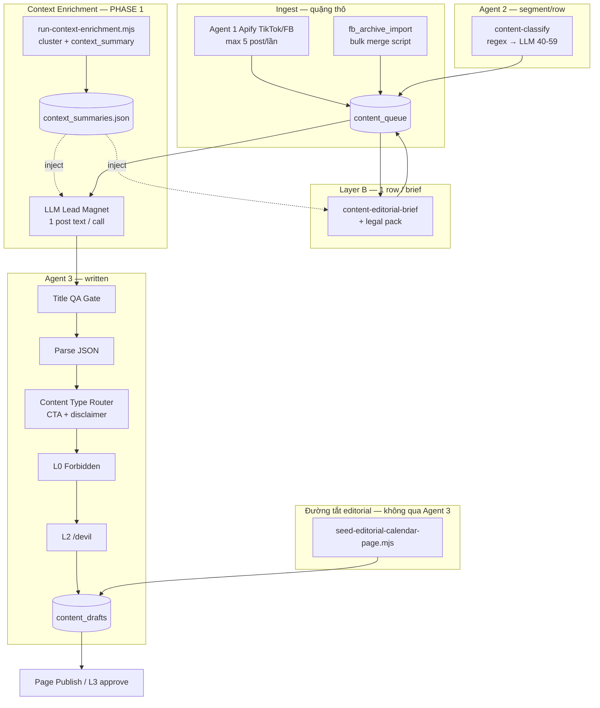
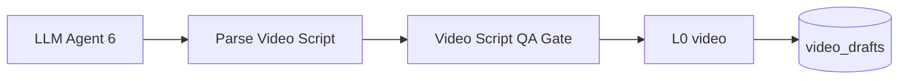

# MAGNIX Pipeline Map — Luồng dữ liệu thực tế

> **Một file đọc trước** khi sửa Title QA / CTA / Disclaimer / Hook / Context.
> Cập nhật: 2026-06-28 · Audit Sheet `Database_Magnix_Lead` (8329 dòng `content_queue`).
>
> **Phạm vi:** file này chỉ mô tả pipeline editorial/content; không định nghĩa hay
> lưu sales CRM state. Sales conversion map: `.cursor/SALES_CONVERSION_PIPELINE_MAP.md`.

---

## Sơ đồ tổng (thứ tự thực tế)



---

## Bảng từng bước

| # | Bước | Workflow / script | Input context | Output | Block vs flag |
|---|------|-----------------|---------------|--------|---------------|
| 0 | Raw scrape | `social-listening` · `social-listening-facebook` | Apify post | `content_queue` + `intake_v1` (Agent 1 LLM) | Reject post → không ghi queue |
| 0b | Bulk archive | `scripts/merge-fb-archive-to-content-queue.mjs` | Tab `_archive_*` | `content_queue` **không** `intake_v1` | Không block — import thẳng |
| 1 | Classify | `content-classify` | **1 dòng** `text` ≤4000 | `segment`, `score`, `status=classified` | LLM chỉ score 40–59 |
| 2 | Editorial brief | `content-editorial-brief` | **1 dòng** `intake_v1` + `text` + legal pack | `meta.editorial_brief_v1` | Legal `needs_human_legal_source` → block downstream |
| 2b | Intake stub | `pipeline-intake-stub.js` | 1 dòng text nếu thiếu intake | `intake_v1` synthetic `_stub:true` | Không block — filler |
| 3 | LLM draft | `content-draft` · `02-llm-lead-magnet.js` | **1 dòng** `pain` ≤2000 + optional brief | JSON title/hook/body | LLM error → skip row |
| 4 | **Title QA Gate** | `02b-title-qa-gate.js` | Title từ JSON LLM | pass / reject | **BLOCK** `title_rejected` · `title_capitalization_error` |
| 5 | Parse | `03-parse-lead-magnet.js` | LLM JSON | `draft` object | **BLOCK** parse fail |
| 6 | **Content Type Router** | `03b-content-type-router.js` | draft + segment/channel | CTA + disclaimer + **hashtags** | Không block; dup topic → flag review |
| 6b | **Hook Completion Gate** | `03c-hook-completion-gate.js` | hook + body + CTA (facebook) | pass / review / reject | **BLOCK** placeholder hook · **FLAG** comment-bait / truncation / frequency |
| 7 | L0 | `04-l0-forbidden-check.js` | Full draft text | `l0_pass` | **BLOCK** forbidden regex |
| 8 | L2 /devil | `06-llm-devil-qa.js` | Legal segments / content_type | `l2_qa.verdict` | **BLOCK** fail → `status=review` |
| 9 | Merge + Sheet | `05-merge-draft-row.js` | draft + QA meta | `content_drafts` row | — |
| 10 | L3 | Human Sheet | `status=approved` | Page publish | **BLOCK** publish nếu ≠ approved |
| 11 | Page publish | `content-page-publish` | hook + body + CTA + disclaimer | Facebook Graph API | L0 trên message |

**Hook Completion Gate:** `.cursor/HOOK_RULES.md` · `cta_templates.json` (`social_mechanics`, `hashtags`) · `code/shared/hook-qa-gate.mjs`

---

## Nhánh video — `format_type = video_script` (Agent 6)



| Bước | Node | Block vs flag |
|------|------|---------------|
| Parse | `03-parse-video-script.js` | **BLOCK** schema invalid |
| Video Script QA | `03b-video-script-qa-gate.js` | **BLOCK** empty visual/verbal hook · **FLAG** legal spoken / CTA dup |
| L0 | `04-l0-forbidden-check.js` | **BLOCK** forbidden |

**Không qua:** Title QA Gate · Hook Completion Gate text post.

Schema: `.cursor/VIDEO_SCRIPT_RULES.md` · Fixture: `tests/fixtures/video-script-noxh-legal-sample.json`

Legacy Agent 6: `format_type=production_brief_v3` (Creatomate beats) — QA Gate skip nếu không có `visual_hook`.

---

## Trục `format_type` (đề xuất — chưa vào ARCHITECTURE §3.1)

| Giá trị | Pipeline | Fields chính |
|---------|----------|--------------|
| `text_post` | Agent 3 | `title`, `hook_line`, `cta_opt_in`, `hashtags` |
| `video_script` | Agent 6 | `visual_hook`, `verbal_hook`, `body_beats`, `verbal_cta`, `caption_cta` |

Độc lập với `content_type` (NOXH_LEGAL, …) và `channel` (facebook/blog_seo).

---

## File rule / config theo module

| Module | Config / doc |
|--------|----------------|
| Title QA Gate | `.cursor/TITLE_RULES.md` · `title_rules.json` · `.cursor/title_whitelist.json` |
| Hook Completion Gate | `.cursor/HOOK_RULES.md` · `cta_templates.json` (`social_mechanics`, `hashtags`) |
| Video Script QA | `.cursor/VIDEO_SCRIPT_RULES.md` · `code/shared/video-script-qa-gate.mjs` |
| Content Type Router | `.cursor/DISCLAIMER_RULES.md` · `disclaimers.json` v2 (reel_short / post_long) · `cta_templates.json` |
| Parse layer | `.cursor/JSON_PARSE_LAYER.md` |
| QA tiers | `.cursor/QA_TIERS.md` |
| Legal gate | `docs/LEGAL_GATE_PIPELINE.md` · `legal-pack-bundle.json` |
| Editorial brief | `ai-agents-prompts/n8n__editorial-brief.md` |
| Lead magnet LLM | `ai-agents-prompts/n8n__lead-magnet-draft.md` · `02-llm-lead-magnet.js` |

---

## Field `content_type` (enum thống nhất)

| Giá trị | Nguồn gán hiện tại | Dùng bởi |
|---------|-------------------|----------|
| `NOXH_LEGAL` | LLM draft / segment `noxh_income` / router map | Disclaimer, CTA, Title formulas |
| `LOAN_FINANCE` | segment `sme_credit` | idem |
| `VALUATION` | segment `valuation` | idem |
| `GENERAL_POLICY` | fallback | idem |

**Đã có (PHASE 1):** cluster archive → `context_summary` theo `content_type` — xem `.cursor/CONTEXT_ENRICHMENT.md` · **PHASE 0 A+B+C xác nhận owner 2026-06-28**

---

## Đường dữ liệu đặc biệt — Editorial calendar

| Script | Ghi vào | Hook/title |
|--------|---------|------------|
| `seed-editorial-queue-layer-b.mjs` | `content_queue` | Title calendar; text stub |
| `seed-editorial-calendar-page.mjs` | `content_drafts` **trực tiếp** | `hook_line = "{title} — nội dung chờ biên tập từ listening/brief."` |

Không qua Agent 3 LLM → không phải lỗi LLM "brief trống".

---

## Store of record

| Tab | Vai trò | Ghi chú audit 2026-06-28 |
|-----|---------|--------------------------|
| `content_queue` | Quặng + queue ops | **8329** dòng |
| `scrape_index` | Dedupe Apify | **0** dòng (import archive bypass) |
| `content_drafts` | Draft publish | **32** dòng; **64.5%** hook placeholder |
| `channel_state` | Lịch scrape Agent 1 | — |

---

## Khắc phục 7 điểm audit (2026-06-28)

| # | Vấn đề | Khắc phục trong repo |
|---|--------|----------------------|
| 1 | Format label sai (Reels viết như bài đọc) | `format_routing.json` — Agent 3 chỉ `text_post` formats; Agent 6 chỉ video; filter ưu tiên editorial |
| 2 | Trùng chủ đề DTI/thu nhập | `content-coverage-map.mjs` + index trong `00-index-published-titles.js` → inject `avoid_recent_titles` LLM; merge `content_coverage_review` |
| 3 | DTI số liệu không nhất quán | `canonical_facts.json` inject prompt Agent 3 — cấm claim "DTI 40% theo luật" |
| 4 | Comment-to-DM lặp | CTA rotation khi vượt `max_comment_unlock_per_week` → `question_then_comment` hoặc `link_direct` |
| 5 | Disclaimer không đồng nhất | Content Type Router inject template (đã có) — LLM để trống `disclaimer` |
| 6 | Giọng văn lệch | `.cursor/BRAND_VOICE.md` inject system prompt Agent 3 |
| 7 | Layer B > Agent 3 bottleneck | Filter Layer B + Agent 3 sort `editorial_priority` (calendar id / scheduled_publish_at) |

---

Chạy **trước** LLM generate hook/title (PHASE 1 — đã OK):

1. Rule-classify post → `content_type` (enum hiện có) — `content_type_rules.json`
2. Cluster → `context_summary` (questions, pains, audience voice)
3. Ngưỡng tối thiểu: **≥8** post/cluster (`content_type`)
4. Thiếu context → `waiting_for_context` (không gọi LLM summary)

Output: `context_summaries.json` — inject Layer B + Agent 3. PHASE 2: cùng enum; Title QA + Router sau LLM.

---

## Lệnh audit nhanh

```bash
node scripts/run-context-enrichment.mjs
node tests/context-enrichment.test.mjs
node scripts/diagnose-agent3-candidates.mjs
node tests/title-qa-gate.test.mjs
node tests/hook-qa-gate.test.mjs
node tests/video-script-qa-gate.test.mjs
node tests/content-type-router.test.mjs
```
