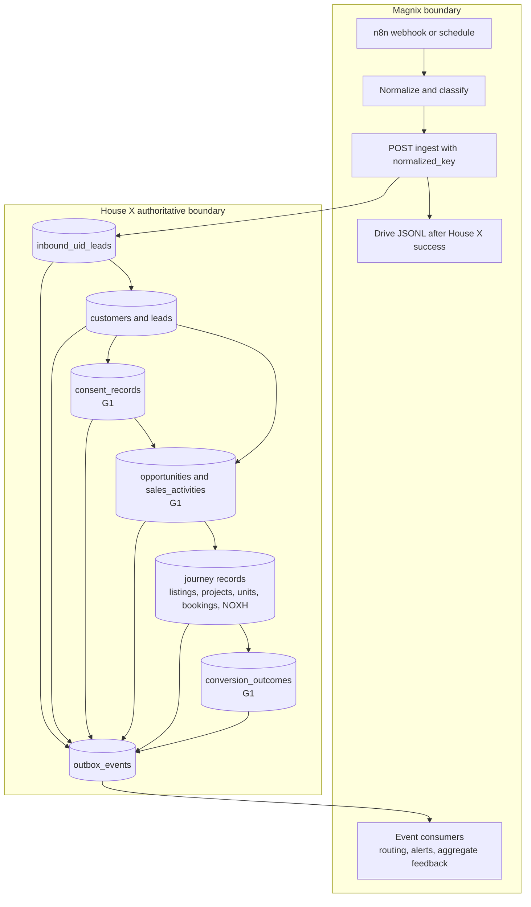
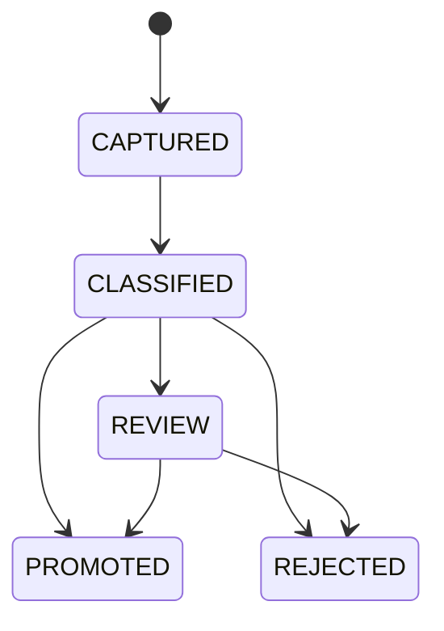
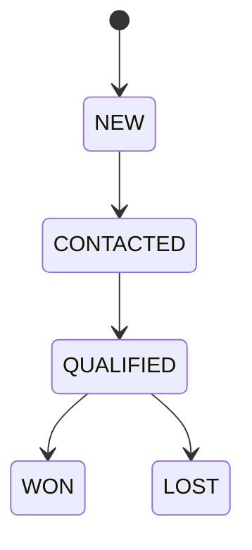
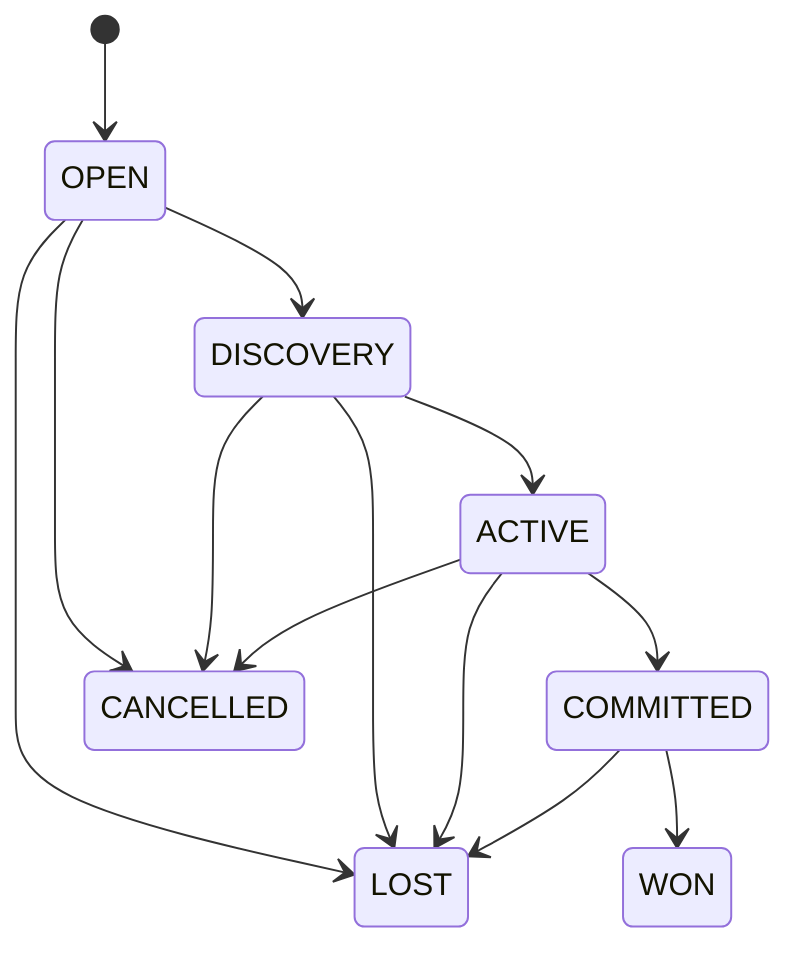
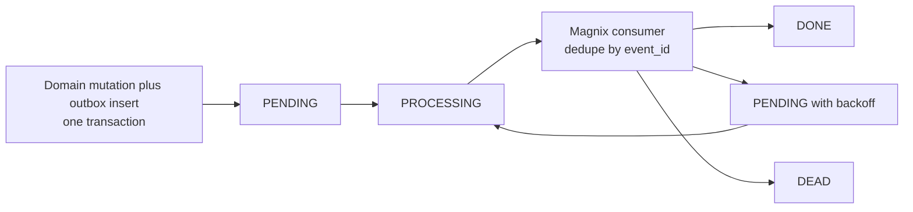

# Sales Conversion Pipeline Map

> Practical operating map for ADR-015. House X is authoritative for identity,
> consent, sales lifecycle, attribution, booking/deal and outcomes. Magnix owns
> acquisition orchestration and consumes minimized events for automation and
> aggregate feedback. Google Sheet is not on the sales write path.

## Deployment legend

- **LIVE** — present in `Proptech-HouseX` today.
- **G1** — additive authoritative foundation required by ADR-015.
- **G2** — journey adoption/read model after G1 controls pass.
- A target name never implies that its table, route or event is already deployed.

## End-to-end operating flow

```mermaid
flowchart LR
  ACQ["Acquisition<br/>capture, normalize, classify"]
  ID["Identity and consent<br/>resolve subject, check purpose and channel"]
  SLA["Assignment and SLA<br/>owner, queue, accept, first response"]
  MATCH["Buyer profile and matching<br/>needs projection plus inventory candidates"]
  ACT["Activity and appointment<br/>attempt, note, task, meeting"]
  PROP["Proposal and booking<br/>offer or journey commitment"]
  OUT["Won or lost<br/>reason and commercial reference"]
  FB["Revenue feedback and nurture<br/>aggregate learning or consent-safe follow-up"]

  ACQ --> ID --> SLA --> MATCH --> ACT --> PROP --> OUT --> FB
  FB -. "new consent-safe touch" .-> ACQ
```





## Stage-by-stage authority and hand-off

| Stage | House X authoritative records | House X command/read surface | Outbox signal | Magnix action |
|---|---|---|---|---|
| Acquisition | **LIVE** `inbound_uid_leads`; source snapshot is immutable in meaning and upserted by external key | **LIVE** `POST /api/ingest/magnix-lead` | **G1** `acquisition.touch_recorded`, `acquisition.touch_promoted` | Capture, normalize, classify, submit; archive only after success |
| Identity / consent | **LIVE** `customers`, `leads`; **G1** `consent_records` append-only | **LIVE** `POST /api/leads`; **G1** `POST /api/conversion/leads`, `POST /api/conversion/consents` | **LIVE** `lead.created`; **G1** `consent.recorded`, `consent.withdrawn` | Never infer contact permission; route only after purpose/channel consent decision |
| Assignment / SLA | **LIVE** `leads.assigned_broker_id`, `attribution_locks`, `attribution_events`, `attribution_conflicts`; SLA timestamps are not yet canonical | **LIVE** admin Ops lead/conflict routes; **G1** activity command carries actor and correlation ID | **LIVE** `attribution.conflict`; **G1** `lead.status_changed` | Notify queue/owner; escalate overdue SLA without changing authoritative owner |
| Buyer profile / matching | **LIVE** `customers`, `leads.ops_meta`, `noxh_cases`; catalog authority in `projects`, `listings`, `project_units` | **LIVE** lead, project, listing and unit reads; **G2** funnel/matching read model | **G1/G2** `opportunity.created`, `opportunity.stage_changed` | Consume stable IDs and match summaries; do not copy a PII-rich buyer profile into Sheet |
| Activity / appointment | **LIVE** `status_history` and NOXH `case_milestone_events`; **G1** `sales_activities` append-only | **LIVE** `PATCH /api/leads/:id/status`, Ops lead and CTV schedule routes; **G1** `POST /api/conversion/activities` | **G1** `lead.status_changed`, `opportunity.stage_changed` | Reminder and notification automation; retries must not duplicate activity |
| Proposal / booking | Journey authority remains specialized: **LIVE** `unit_bookings`, `project_units`, `noxh_cases`; A/S modules retain their subscription/deal authority | **LIVE** unit-booking and NOXH routes; **G1/G2** opportunity command references journey subject | **LIVE** `ops.request_created`, `noxh_case.milestone_changed`; **G1** opportunity events | Generate operational reminders or approved collateral only; never bypass inventory, legal, verification or payment gates |
| Won / lost | **LIVE** `leads`, `status_history`, `commissions`; journey booking/case records; **G1** `conversion_outcomes` references—not replaces—journey deal | **LIVE** lead status and booking conversion routes; **G1** activity/outcome transition; **G2** `GET /api/conversion/funnel` | **LIVE** `lead.won`, `commission.created`; **G1** `conversion.won`, `conversion.lost` | Consume minimized outcome and reason; no independent CRM status |
| Revenue feedback / nurture | **LIVE** `outbox_events`, lead nurture dispatch metadata; outcome/value stays House X authoritative | **LIVE** outbox dispatcher and Ops lead update; **G2** scoped funnel read | **LIVE** `lead.nurture`; **G1** conversion events | Update aggregate campaign/content signals; nurture only for allowed purpose/channel |

### Buyer profile and matching rule

“Buyer profile” is a read projection, not a new source of truth. It combines stable
references and minimum necessary fields from `Customer`, `Lead`, `Opportunity`,
journey records and inventory. A match is a recommendation; it does not reserve a
unit, validate legal eligibility, change opportunity stage or prove consent.

### Assignment and SLA rule

Assignment has three distinct facts: authoritative owner, acceptance, and elapsed
SLA. Current House X stores owner/attribution but has no canonical cross-journey SLA
entity. Until G1 activity fields are reviewed, automation may calculate an overdue
projection from timestamps but must not persist a competing owner or sales status.

## State semantics



- Acquisition retry with the same `normalized_key` updates the ingest snapshot; it
  does not create a second touch.
- `PROMOTED` means a lead was created or linked. It does not mean contactable,
  qualified or consented.
- A raw UID is not a `Customer` and is never treated as a phone number.



- `CONTACTED` means Ops accepted/performed a contact attempt under current UI
  semantics; `QUALIFIED` means contact plus confirmed minimum need.
- Acquisition score never advances lead state.
- `WON` and `LOST` are terminal for that lead. Reopening requires an explicit,
  audited transition or a new lead according to the approved lifecycle rule.



- Opportunity is **G1** and always has one `journey = A | S | P` plus an optional
  subject reference.
- `COMMITTED` requires proof from the journey module: valid ad subscription (A),
  managed agreement/deal (S), or valid booking/deposit/deal (P).
- Every transition records actor, time, from/to, reason and correlation ID.
- `ConversionOutcome` records normalized won/lost facts; it never replaces
  `UnitBooking`, a journey Deal/Subscription, `NoxhCase`, payment or commission.

Consent is not a mutable funnel state. **G1** `ConsentRecord` is an append-only
ledger of `GRANTED | DENIED | WITHDRAWN | EXPIRED | SUPERSEDED`; effective consent
is derived by subject + purpose + channel. Denial/withdrawal wins immediately.

## APIs and event contract

### Commands

| Contract | Status | Idempotency / authority |
|---|---|---|
| `POST /api/ingest/magnix-lead` | LIVE | `normalized_key`; upserts `inbound_uid_leads` |
| `POST /api/leads` | LIVE legacy/current | Optional `Idempotency-Key`; resolves `Customer`, creates `Lead` and attribution |
| `POST /api/conversion/leads` | G1 | Required idempotency key; controlled identity resolution and lead create/link |
| `POST /api/conversion/opportunities` | G1 | Idempotency key or deterministic journey subject key |
| `POST /api/conversion/activities` | G1 | Deterministic activity key; append-only actor/correlation audit |
| `POST /api/conversion/consents` | G1 | Deterministic proof/action key; append only |
| `GET /api/conversion/funnel` | G2 | Scoped read model; excludes PII unless caller has explicit scope |

Success is `{ "ok": true, "data": { ... } }`. Validation/conflict returns
`{ "ok": false, "error": "CODE", "message": "...", "retryable": false }`.
Only retryable server failures use 5xx.

### Canonical event envelope

```json
{
  "event_id": "stable-uuid",
  "type": "opportunity.stage_changed",
  "occurred_at": "2026-07-17T10:00:00Z",
  "aggregate_type": "opportunity",
  "aggregate_id": "stable-id",
  "correlation_id": "request-or-workflow-id",
  "schema_version": 1,
  "payload": {
    "journey": "P",
    "from_stage": "ACTIVE",
    "to_stage": "COMMITTED",
    "reason": "booking_confirmed"
  }
}
```

Canonical ADR-015 event set:

- `acquisition.touch_recorded`, `acquisition.touch_promoted`
- `lead.created`, `lead.status_changed`
- `opportunity.created`, `opportunity.stage_changed`
- `consent.recorded`, `consent.withdrawn`
- `conversion.won`, `conversion.lost`

Current House X also emits operational events including `lead.won`,
`commission.created`, `lead.nurture`, `attribution.conflict`,
`ops.request_created` and `noxh_case.milestone_changed`. G1 must map/evolve these
without silently treating the current `{ type, payload, sentAt }` webhook as the
full canonical envelope.

## Delivery, retry, DLQ and idempotency



- Producer: `outbox_events.dedupe_key` is unique; mutation and enqueue share one
  House X transaction.
- Dispatcher: at-least-once delivery, atomic claim, maximum 8 attempts, exponential
  backoff from 30 seconds capped at 1 hour, then `DEAD`.
- DLQ operations: alert on new `DEAD`, inspect masked `last_error`, repair the cause,
  then replay the same event identity. Never mint a new business event to hide a
  delivery failure.
- Consumer: persist/check `event_id` before side effects. During migration, a
  deterministic legacy key such as `type + aggregate_id` is required where the
  current envelope has no `event_id`.
- HTTP: retry 5xx/timeouts with bounded backoff; do not retry 4xx validation,
  authorization or conflict errors without correcting the request.
- Archive: Drive JSONL is best-effort only after ingest success and is never replay
  authority, consent authority or an operational lookup.

## PII and consent boundary

- House X stores minimum identity/consent proof under RBAC, retention and audit.
  Logs use stable IDs or short hashes, never full UID, phone, email or documents.
- Magnix ingest may transport acquisition PII only to the authorized API. Magnix
  Sheet/event consumers receive stable IDs, journey, stage/reason and masked or
  aggregated values needed for their declared purpose.
- Never place full phone/email/UID, financial details, identity/legal documents,
  access tokens or consent proof attachments in outbox payloads, Sheet mirrors,
  Drive operational indexes or source control.
- `consent_basis`, UTM, campaign opt-in and source provenance are context only.
  Before outreach, check authoritative effective consent for both purpose and
  channel. Service/operational messages remain separate from marketing purpose.
- Revenue feedback to Magnix is aggregate by source/campaign/content/segment and
  outcome reason. Row-level export requires a separately reviewed purpose/scope.

## Magnix consumer map

| Consumer | Input | Allowed side effect | Prohibited |
|---|---|---|---|
| `housex-noxh-lead-route` / HouseX events webhook | LIVE `lead.created`, `lead.nurture`, `attribution.conflict`, `noxh_case.*` | Route, notify, create consent-safe tasks; consumer dedupe | Writing CRM state to Sheet |
| Acquisition ingest workflow | UID/source text and metadata | Normalize, classify, call House X, archive success | Resolving identity or granting consent |
| SLA/reminder consumer | G1 lead/activity/opportunity events | Notify owner/Ops, schedule escalation | Reassigning owner or advancing stage locally |
| Revenue feedback consumer | G1 conversion events or G2 funnel aggregate | Update campaign/content performance signals | Receiving unnecessary customer PII |
| Nurture consumer | Consent decision plus allowed channel/purpose | Send/schedule approved nurture and record result through House X | Sending from provenance or score alone |

## G0–G2 gates

### G0 — Contract and boundary

- This map, ADR-015 and `ARCHITECTURE_MAGNIX.md` agree on vocabulary and ownership.
- Inventory current versus target schema/API/event contracts; approve event envelope,
  PII minimization and legacy-event mapping.
- No sales Ops/dedupe write path uses Google Sheet; Magnix does not own CRM state.

### G1 — Authoritative foundation

- Add rollback-tested `ConsentRecord`, `Opportunity`, `SalesActivity` and
  `ConversionOutcome` schema/API components without parallel authorities.
- Require idempotent commands and transactional canonical outbox events.
- Prove duplicate/retry safety, consumer dedupe, DLQ replay, RBAC/PII controls and
  immediate marketing block after withdrawal.

### G2 — Journey adoption

- Map A/S/P subjects, commitment evidence, legal/verification/payment gates and
  won/lost reasons; expose a scoped funnel read model.
- Run one reconciled end-to-end conversion path per journey with no gate bypass.
- Approve metrics reconciliation, migration rollback and operations runbook.

G2 for any journey is blocked until G1 consent and idempotency controls pass.
