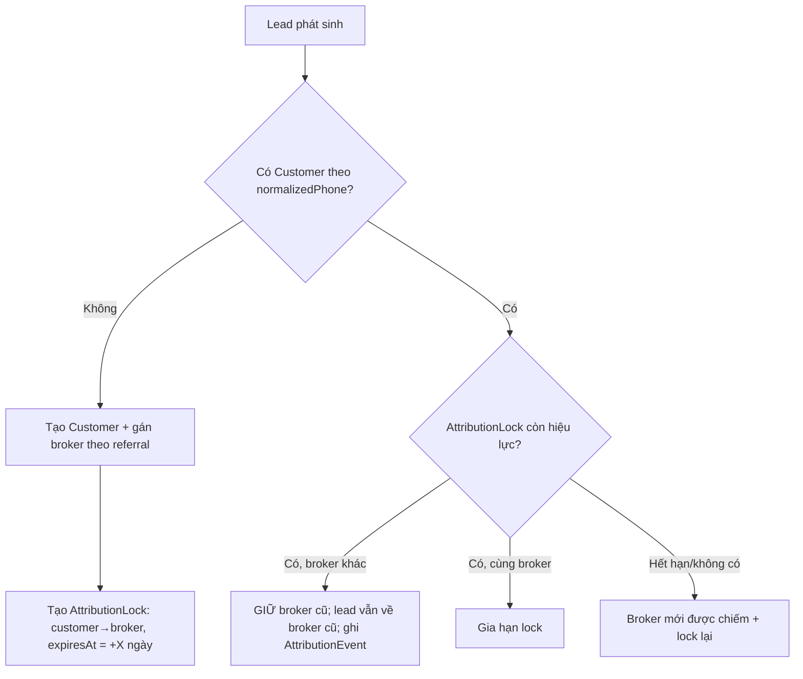
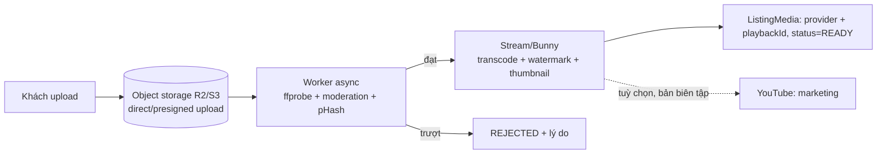

# ADR & Chiến lược tối ưu nền tảng Proptech HouseX

> Tài liệu kiến trúc (Architecture Decision Record + chiến lược). Ghi lại các quyết
> định đã thống nhất để định hướng triển khai sau MVP Phase 1–3.
> Trạng thái tổng: **Accepted** — chờ triển khai theo roadmap mục 9.

## 1. Bối cảnh & mục tiêu

MVP hiện tại (Phase 1–3) đã đúng nghiệp vụ lõi `Project · Listing · Broker · Referral`
nhưng mới ở mức "mỏng". Mục tiêu của tài liệu này: nâng từ MVP lên **nền tảng
marketplace tối ưu**, tập trung 4 bài toán sống còn:

1. Chống "lộn cò" (cướp khách / trùng khách) giữa các môi giới/CTV.
2. Kiểm soát nội dung: tin trùng, tiêu đề trùng, lỗi SEO.
3. Tiêu chuẩn media + thuật toán ưu tiên đề xuất (ranking).
4. Hạ tầng tìm kiếm / geo / video không làm quá tải VPS.

Triết lý kế thừa từ Magnix (`.cursorrules`): dedup theo `normalized_key`, QA phân tầng
L0–L3, rule-engine trước LLM, VPS = compute-only (không lưu trữ nặng trên VPS).

## 2. Đánh giá hiện trạng (gaps)

| Trụ cột | Hiện trạng | Rủi ro |
|---|---|---|
| Search | `findMany` + filter tỉnh/huyện | Không full-text/fuzzy/ranking — Proptech sống bằng search |
| Geospatial | `lat/lng` kiểu `Float` | Không truy vấn bán kính hiệu quả |
| Định danh khách | `Customer.phone` không unique, mỗi lead tạo customer mới | Gốc rễ của lộn cò & trùng khách |
| Event-driven | rule #4 chạy inline trong request | Không mở rộng được sang payment/notify/CRM |
| Audit/lịch sử | Không có | Không xử lý tranh chấp attribution có bằng chứng |
| Click tracking | `increment` thẳng DB | Cột nóng, dễ bị bơm số ảo / DDoS |
| Schema | `Referral.listingId` không có relation `listing` | Phải workaround khi resolve |
| Idempotency | Không có | Double-submit form = nhân đôi lead/customer |

---

## 3. ADR-001 — Identity Resolution (định danh khách)

**Quyết định:** Chuẩn hoá SĐT về E.164, tạo `normalizedPhone` **unique** trên
`Customer`. Lead mới **resolve về Customer đã tồn tại**, không tạo trùng.

**Lý do:** Không có định danh ổn định thì không thể chống lộn cò, không thể dedup khách.

```prisma
model Customer {
  // ...
  normalizedPhone String  @unique @map("normalized_phone") // +84xxxxxxxxx
  phoneHash       String? @map("phone_hash")               // tuỳ chọn, ẩn PII
}
```

Hệ quả: `POST /api/leads` phải normalize phone → `upsert` customer theo
`normalizedPhone` thay vì luôn `create`.

## 4. ADR-002 — Attribution Lock (chống "lộn cò")

**Quyết định:** Quyền sở hữu khách dựa trên **định danh phía server**, không phụ thuộc
cookie. Một khách, trong một cửa sổ thời gian, **chỉ thuộc 1 broker**.

**Cơ chế:**



```prisma
model AttributionLock {
  id         String   @id @default(uuid())
  customerId String   @unique @map("customer_id")
  brokerId   String   @map("broker_id")
  referralId String?  @map("referral_id")
  source     String                         // referral | first_lead | manual
  lockedAt   DateTime @default(now()) @map("locked_at")
  expiresAt  DateTime @map("expires_at")     // cửa sổ 30–90 ngày
  @@map("attribution_locks")
}

model AttributionEvent {                      // audit mọi lần gán/tranh chấp
  id         String   @id @default(uuid())
  customerId String   @map("customer_id")
  fromBroker String?  @map("from_broker")
  toBroker   String?  @map("to_broker")
  reason     String                           // first_touch | conflict_kept | expired_reassign
  createdAt  DateTime @default(now()) @map("created_at")
  @@index([customerId])
  @@map("attribution_events")
}
```

**Quy tắc cứng:**
- First-touch trong cửa sổ khoá: khách đã thuộc A → lead mới (kể cả từ link B) vẫn về A.
- Cooldown: A không chốt trong X ngày → khách "tự do", B mới được chiếm. Đòn bẩy buộc CTV chăm khách.

**Chống gian lận:**
- Chặn self-referral: `broker.phone == customer.normalizedPhone`.
- Velocity check click/lead theo IP/giờ (Redis).
- Click dedup theo `(referralCode, ipHash, day)` trong Redis (không cộng thô vào DB).
- Commission có trạng thái thu hồi: `DISPUTED` / `CLAWBACK`.

## 5. ADR-003 — Chống tin đăng & ảnh trùng lặp

**Quyết định:** Dedup 2 tầng + gom "1 BĐS nhiều broker" về canonical.

- **Tầng A (hard dupe, chặn khi tạo):** `dupeKey = hash(normalizedPhone + propertyType + province + district + round(price) + round(area))`. Trùng trong N ngày → từ chối/gộp.
- **Tầng B (near dupe, mềm):**
  - Text: SimHash/MinHash trên mô tả chuẩn hoá; hoặc `pg_trgm.similarity()` cho nhẹ; pgvector nếu cần ngữ nghĩa.
  - Ảnh: **perceptual hash (pHash)** từng ảnh → phát hiện ảnh trùng/ăn cắp/stock.
  - **CanonicalProperty:** cùng `(projectId, unitType, tầng, hướng, diện tích, ảnh pHash)` → 1 BĐS gốc, nhiều listing là "offer" của các broker. Trang public hiển thị 1 BĐS + danh sách broker (chống loãng SEO + UX rác).

```prisma
model ListingFingerprint {
  listingId   String   @unique @map("listing_id")
  contentHash String   @map("content_hash")     // SimHash mô tả
  imagePhash  String[] @map("image_phash")       // pHash từng ảnh
  dupeKey     String   @map("dupe_key")
  canonicalId String?  @map("canonical_id")
  @@index([dupeKey])
  @@index([canonicalId])
  @@map("listing_fingerprints")
}
```

## 6. ADR-004 — Kiểm soát tiêu đề trùng & SEO

**Quyết định:** Sinh tiêu đề theo template + gate trùng, canonicalization cho near-dupe.

- Title template: `{giao dịch} {loại} {diện tích} {dự án/đường}, {quận}`; check trùng bằng trigram **trước khi publish** (port `title-qa-gate` từ Magnix sang).
- Near-dupe → `<link rel="canonical">` về listing gốc, bản sao `noindex` → tránh phạt thin/duplicate content.
- Gate độ dài mô tả tối thiểu; validate JSON-LD; sitemap động `lastmod`.
- Quality gate L0–L3 (tái dùng `QA_TIERS`): L0 spam/forbidden (SĐT trong mô tả) → L1 completeness → L2 near-dupe/ảnh → L3 human cho tier cao.

## 7. ADR-005 — Hạ tầng media (video/ảnh) — **đã chốt**

**Quyết định:**
- **CDN phát chính = managed video** (Cloudflare Stream **hoặc** Bunny Stream).
  Lý do: tự transcode + adaptive bitrate + thumbnail + **watermark** + signed URL,
  **không chạy ffmpeg trên web-VPS**, không tốn băng thông VPS, giữ branding, xoá được
  khi listing chết.
- **YouTube = chỉ kênh marketing top-funnel** (nối content pipeline Magnix), **không**
  dùng làm player phát trên trang tin.
- **Watermark + thumbnail = dùng tính năng sẵn của nhà cung cấp** (Stream/Bunny watermark profile).
- **Kiểm tra chất lượng = worker async** (ngoài web-VPS): `ffprobe` (độ phân giải/độ dài/
  bitrate/codec), độ mờ/độ sáng, có audio; moderation (NSFW/PII); video pHash để dedupe.

**Vì sao KHÔNG dùng YouTube làm host chính (đã loại):**
- API quota ~10.000 unit/ngày, `videos.insert` ~1.600 unit → chỉ ~6 video/ngày; nâng quota thường bị từ chối.
- Mass-upload tự động dễ bị khoá kênh → **1 kênh chết = mất toàn bộ video listing** (single point of failure).
- Bản quyền: upload video khách lên kênh mình cần điều khoản cấp quyền; Content ID có thể flag.
- Watermark vẫn phải re-encode → không né được compute nếu tự làm.
- Player kèm quảng cáo/đề xuất của đối thủ, kéo khách rời nền tảng; SEO lợi cho kênh YouTube chứ không cho trang listing.

**Pipeline media (mọi việc nặng đều async, ngoài web-VPS):**



**Mở rộng `ListingMedia`:**

```prisma
model ListingMedia {
  // ... giữ nguyên các field cũ ...
  provider    String?  // bunny | cloudflare_stream | image_cdn
  playbackId  String?  @map("playback_id")
  status      String   @default("READY") // UPLOADING | PROCESSING | READY | REJECTED
  durationSec Int?     @map("duration_sec")
  width       Int?
  height      Int?
  phash       String?
}
```

> Lưu ý triển khai: trang tin phải xử lý trạng thái `PROCESSING` (video chưa sẵn sàng
> ngay sau upload do transcode async).

## 8. ADR-006/007/008 — Ranking, Search/Geo, Event-driven

**ADR-006 — Quality & Ranking.** Điểm xếp hạng feed/search:

```
score = w1·TierBoost + w2·QualityScore + w3·Freshness + w4·Verified
      + w5·Engagement + w6·GeoRelevance
      − penalty(nearDupe, spam, lowQuality, expired)
```

Nguyên tắc: tier trả phí chỉ là **một** trọng số; PREMIUM được boost nhưng vẫn phải đạt
`QualityScore` tối thiểu (đủ ảnh/video/mô tả/structured data) mới lên đề xuất — để feed
không bị tiền mua sập chất lượng. Thêm `qualityScore`, `rankScore`, `photoCount`,
`hasVideo` vào `Listing` (precompute, cron cập nhật).

**ADR-007 — Search & Geo.** PostGIS (`geography(Point)` + GiST index) cho truy vấn bán
kính; **Meilisearch/Typesense** (self-host, rẻ) cho full-text + fuzzy + ranking. `findMany`
hiện tại không phải đường dài.

**ADR-008 — Event-driven.** Outbox table → queue cho `lead.won → commission → notify`,
tách khỏi request đồng bộ; Redis cho click counter + rate limit + idempotency key
(`POST /leads`).

## 9. Roadmap ưu tiên

| Ưu tiên | Hạng mục | ADR | Trạng thái |
|---|---|---|---|
| **P0** | Identity Resolution (`normalizedPhone unique`) + Attribution Lock + Event log | 001, 002 | ✅ Đã triển khai |
| **P0** | Redis: click dedup + rate limit + idempotency key cho `POST /leads` | 008 | ✅ Đã triển khai (Redis optional, fallback in-memory) |
| **P1** | Media pipeline: provider Stream/Bunny + worker QC + pHash + `ListingMedia` mở rộng | 005 | ✅ Đã triển khai |
| **P1** | Search & Geo: bbox+haversine (default) / PostGIS (scale) + Meilisearch | 007 | ✅ Đã triển khai |
| **P1** | Content control: `ListingFingerprint` (SimHash + dupeKey) + CanonicalProperty + title/SEO gate | 003, 004 | ✅ Đã triển khai (pHash ảnh để sau) |
| **P2** | Quality/Ranking score + tiêu chuẩn media gate (≥5 ảnh, video 9:16) | 006 | ✅ Đã triển khai |
| **P2** | Event-driven outbox (sẵn sàng nối payment) | 008 | ✅ Đã triển khai |
| **P3** | Fix schema gaps: relation `listing` cho `Referral`, soft-delete, status history | — | ✅ Đã triển khai |

### Ghi chú triển khai P0 (đã xong)

- Schema: `Customer.normalizedPhone @unique`, model `AttributionLock`, `AttributionEvent`.
- `lib/phone.ts` (E.164 VN), `lib/redis.ts` (KV: setNx/get/set/rateLimit, fallback in-memory),
  `lib/rules/attribution-lock.ts` (resolveAttribution), `lib/api/request-meta.ts` (ipHash).
- `POST /api/leads`: normalize phone → upsert customer theo `normalizedPhone` →
  `resolveAttribution` trong transaction → idempotency (`Idempotency-Key`) + rate limit IP.
- `GET /api/referrals/:code/redirect`: click dedup theo `(code, ipHash, ngày)`.
- **Cần chạy migration** khi có DB: `npm run db:migrate` (tạo bảng mới + cột `normalized_phone`).
  Lưu ý: cột `normalized_phone` là NOT NULL unique — nếu DB đã có dữ liệu `customers` cũ,
  cần backfill trước khi apply (script normalize phone → set giá trị).

### Ghi chú triển khai P1 — Content Control (đã xong)

- Schema: `CanonicalProperty`, `ListingFingerprint` (+ relation `Listing.fingerprint`).
- `lib/content/` (pure, có test): `normalize.ts`, `simhash.ts` (SimHash 64-bit + Hamming),
  `fingerprint.ts` (`dupeKey` + `contentHash` + `canonicalKey`), `title.ts`.
- `lib/rules/listing-content-gate.ts`: chặn hard-dupe (cùng `dupeKey`) + near-dupe cùng
  broker; khác broker gần giống → cho qua để gom canonical.
- `POST /api/listings`: chạy gate trước khi tạo; tạo listing + upsert canonical +
  fingerprint trong transaction. `PATCH` tính lại fingerprint khi nội dung đổi.
- `/tin-dang/[code]`: tiêu đề sinh chuẩn (`buildListingTitle`), **canonical + noindex**
  cho tin không phải đại diện cụm, section "N môi giới khác cùng bán BĐS này".
- Test: `npm test` (7/7 pass). Ngưỡng near-dupe: `CONTENT_NEAR_DUPE_BITS` (mặc định 3/64).
- **Chưa làm (để sau):** dùng pHash ảnh trong gate text (đã có pHash, chưa nối vào
  quyết định near-dupe), LSH/banding khi số listing lớn (hiện so sánh trong tập ứng
  viên giới hạn 300).

### Ghi chú triển khai P1 — Media pipeline (đã xong)

- Schema: mở rộng `ListingMedia` (`provider`, `playbackId`, `status`, `width`,
  `height`, `durationSec`, `phash`, `rejectReason`).
- `lib/media/provider.ts`: abstraction + `StubProvider` (dev) + `BunnyStreamProvider`
  + `CloudflareStreamProvider` (gọi API thật khi có key), factory theo `MEDIA_PROVIDER`.
  Watermark/thumbnail = cấu hình ở library/profile của provider (không transcode ở VPS).
- `lib/media/quality.ts` (pure, test): chuẩn ảnh ≥1024px; video ≥720p, 5–120s.
- `lib/media/phash.ts` (pure, test): pHash DCT 64-bit + Hamming (toán tách khỏi giải mã ảnh).
- API: `POST /api/listings/:id/media` (video → direct upload provider, trả `uploadUrl`;
  ảnh → url CDN + QC nếu có kích thước), `POST /api/webhooks/media` (provider báo
  transcode xong → QC metadata → READY/REJECTED), bảo vệ bằng `MEDIA_WEBHOOK_SECRET`.
- Worker QC ảnh: `scripts/media-image-qc.ts` (sharp decode 32×32 xám → pHash → cập nhật
  media + nạp `imagePhash` vào fingerprint). Chạy: `npm run media:qc -- --media <id> --url <...>`.
- Reads chỉ hiển thị media `status = READY` (trang tin/marketplace/json-ld).
- Test: `npm test` (12/12 pass).

### Ghi chú triển khai P1 — Search & Geo (đã xong)

- **Geo (mặc định, không cần extension):** `lib/geo/haversine.ts` (pure, test) —
  `haversineKm` + `boundingBox`. `lib/geo/nearby.ts` prefilter bằng bounding-box
  (index `lat`/`lng`) rồi tính haversine chính xác + sort trong app.
  API `GET /api/listings/nearby?lat=&lng=&radiusKm=`.
- **Geo (scale):** `prisma/sql/enable-postgis.sql` — bật PostGIS, cột `geog`
  generated + GiST index, chuyển sang `ST_DWithin` qua `$queryRaw`. Chỉ cần khi
  dữ liệu lớn; mặc định KHÔNG phụ thuộc PostGIS.
- **Search:** `lib/search/provider.ts` — interface `SearchClient` + `MeiliClient`
  (REST qua fetch, không thêm SDK), factory theo `MEILI_HOST`. `listing-doc.ts`
  map listing → doc (kèm `_geo`). Có thể thay Typesense bằng client khác cùng interface.
- API `GET /api/search/listings`: q + filter (province/district/propertyType/
  transactionType/tier) + geo. Dùng Meili nếu cấu hình; **fallback DB** (ilike +
  nearby) khi chưa có search server → dev chạy ngay.
- Đồng bộ index: `reindexListingSafe` (best-effort) gọi sau create/patch và trong
  cron expire (gỡ tin hết hạn). Full reindex: `npm run search:reindex`.
- DB vẫn là source of record; search/geo chỉ là lớp truy vấn/index.
- Test: `npm test` (17/17 pass).

### Ghi chú triển khai P2 — Quality/Ranking + media gate (đã xong)

- Schema: thêm cột precompute vào `Listing` — `photoCount`, `hasVideo`,
  `qualityScore`, `rankScore`, `rankUpdatedAt` + index `(status, rankScore)`.
- **Pure (test):** `lib/rules/ranking.ts` — `computeQualityScore` (0–100: ảnh/video/
  mô tả/verified/structured/geo) + `computeRankScore` (tierBoost + quality·0.4 +
  freshness decay 14 ngày + verified + engagement(leadCount) − penalty lowQuality).
  `lib/rules/listing-publish-gate.ts` — gate đăng: ≥`LISTING_MIN_PHOTOS` ảnh READY,
  mô tả ≥`LISTING_MIN_DESC_LEN`, video (nếu có) phải READY hết.
- **Glue:** `lib/data/ranking.ts` — `mediaCountsFor`, `recomputeListingRanking`,
  `recomputeActiveRankings`. Gọi sau create/patch, sau media READY (webhook +
  image-qc worker + media init), và cron.
- **Gate enforce:** `POST /api/listings` (status=ACTIVE) + `PATCH` (chuyển sang
  ACTIVE) trả 422 `PHOTO_MIN`/`DESC_MIN`/`VIDEO_NOT_READY` nếu chưa đạt.
- **Ranking áp dụng:** feed `GET /api/listings`, marketplace dự án, search fallback
  DB đều `orderBy rankScore desc`. Search doc thêm `rankScore` (sortable Meili;
  dùng khi không có từ khoá để giữ relevance).
- **Cron/script:** `POST /api/cron/recompute-ranking` (CRON_SECRET) +
  `npm run ranking:recompute` để backfill/refresh freshness định kỳ.
- Nguyên tắc: tiền (tier) chỉ là 1 trọng số — tin PREMIUM chất lượng thấp vẫn bị
  phạt, FREE chất lượng cao có thể vượt. Test minh hoạ điều này.
- Test: `npm test` (28/28 pass).

### Ghi chú triển khai P2 — Event-driven outbox (đã xong)

- Schema: model `OutboxEvent` (type, payload Json, `dedupeKey @unique`, status
  PENDING/PROCESSING/DONE/DEAD, attempts/maxAttempts, availableAt, lockedAt,
  lastError) + index `(status, availableAt)`.
- **Producer (transactional outbox):** `lib/events/outbox.ts#enqueueEvent` ghi event
  CÙNG transaction với thay đổi domain → atomic, không mất event. `createMany`
  + `skipDuplicates` để dedupe theo `dedupeKey` mà không vỡ transaction.
- Tích hợp: `PATCH /api/leads/:id/status` khi → WON enqueue `lead.won` +
  `commission.created` (trong cùng tx tạo commission). Commission vẫn tạo đồng bộ
  (đảm bảo tính đúng), chỉ side-effect (notify) là async.
- **Dispatcher:** `lib/events/dispatcher.ts#dispatchOutbox` — claim từng event
  atomically (`updateMany where status=PENDING`), chạy handler, rồi DONE / retry
  (backoff luỹ thừa, trần 1h) / DEAD khi vượt `maxAttempts`. An toàn nhiều worker.
- **Handler:** `lib/events/handlers.ts` forward sang n8n (`EVENTS_WEBHOOK_URL`,
  header `x-events-secret`); chưa cấu hình → log. Delivery at-least-once →
  consumer phải idempotent. `backoffSeconds` pure, có test.
- **Chạy:** `POST /api/cron/dispatch-events` (CRON_SECRET, mỗi phút) hoặc
  `npm run events:dispatch [-- --loop]`.
- Sẵn sàng nối payment: thêm type mới (vd `commission.paid`) + handler, không đụng
  request path.
- Test: `npm test` (31/31 pass).

### Ghi chú triển khai P3 — Schema gaps (đã xong)

- **Relation `listing` cho `Referral`:** thêm `Referral.listing` (+ back-relation
  `Listing.referrals`). `redirect` route bỏ tra listing rời, dùng `include` trực tiếp.
- **Soft-delete:** thêm `deletedAt` vào `Listing` + `Project` (+ index). Mọi public
  read lọc `deletedAt: null` (list/detail/search/nearby/marketplace/canonical, search
  index, recompute ranking). `DELETE /api/listings/:id` và `DELETE /api/projects/:slug`
  = soft delete (giữ bản ghi để bảo toàn attribution/commission), gỡ khỏi search index.
- **Status history:** model `StatusHistory` (generic: entity/entityId/from/to/reason/
  actor). `lib/data/status-history.ts#recordStatusChange` (no-op nếu from===to) gọi
  trong cùng transaction tại: listing PATCH/DELETE, lead status PATCH, project
  status PATCH/DELETE.
- **Migration:** `npm run db:migrate` (cột `deleted_at`, FK referral→listing, bảng
  `status_history`). `deletedAt` nullable nên không cần backfill.
- Test/build: `npm test` (31/31) + `next build` OK.

## 10. Tiêu chuẩn media (để gate đăng & làm tín hiệu ranking)

- **Ảnh:** tối thiểu 5, khuyến nghị 8–15; cạnh dài ≥ 1024px; đủ góc (ngoại thất, khách,
  bếp, ngủ, WC, giấy tờ với NOXH); anti-stock bằng pHash; watermark + strip EXIF.
- **Video:** dọc 9:16, 15–60s, ≥1080p cho feed; có cover frame; walkthrough thật > slideshow;
  360°/virtual tour = điểm cộng ranking cao nhất.

---

*Tài liệu này là định hướng; mỗi ADR sẽ được triển khai theo roadmap và cập nhật trạng
thái khi hoàn thành.*
