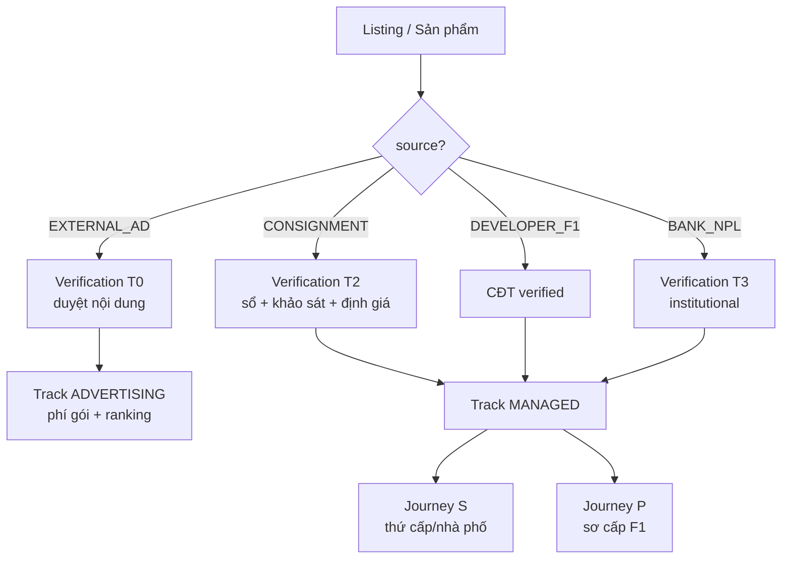
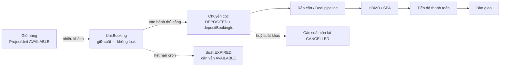

# ADR Mô hình nền tảng HouseX — 3 trục × 3 journey + Legal Gate

> Architecture Decision Record cấp **chiến lược nền tảng** (bổ sung cho
> `ARCHITECTURE_OPTIMIZATION.md` — tài liệu đó tối ưu *track quảng cáo/listing*).
> Tài liệu này định hình HouseX thành **sàn lai**: vừa là *sàn giao dịch có quản lý*
> (managed exchange) vừa là *kênh đăng tin quảng cáo* (classifieds), gom đa nguồn hàng
> theo các **lớp xác minh + phân loại** khác nhau.
>
> **Trạng thái:** `Proposed` — chốt mô hình trước khi phác schema từng phase.
> **Đánh số tiếp:** ADR-009 → ADR-013 (nối tiếp ADR-001…008).
>
> **Namespace đánh số:** ADR-009…013 trong tài liệu này là chuỗi ADR **nội bộ của
> Platform Model HouseX**, giữ nguyên để bảo toàn lịch sử và tham chiếu đã phát hành.
> Chúng không cùng namespace với ADR cấp Magnix/House X tại root `.cursor/`
> (ví dụ ADR-013 storage, ADR-014 Mini App, ADR-015 conversion); không renumber một
> chuỗi để tránh “trùng số” với chuỗi kia.

---

## 1. Bối cảnh & mục tiêu chiến lược

MVP Phase 1–3 + tối ưu (ADR-001…008) đã xong **một** mô hình: listing + referral +
ranking + chống lộn cò/trùng tin. Nhưng định hướng kinh doanh thực tế rộng hơn:

- **Định hướng (đã chốt với chủ dự án):** HouseX đi theo mô hình **Thiên Khôi / Citics
  Homes** — *bao quát nguồn hàng như một sàn nội bộ kết nối **Đầu chủ** (săn nguồn) và
  **Đầu khách** (bán hàng)*, kết hợp **chủ đầu tư** dự án (chung cư thương mại + NOXH)
  để phân phối **sản phẩm F1 (sơ cấp)**.
- **Thực tế giai đoạn khởi tạo:** cần **nguồn hàng & thông tin sản phẩm đa dạng** ngay,
  nên **chấp nhận tin đăng quảng cáo từ môi giới ngoài** — cách `batdongsan.vn`,
  `Home101`, `Rever` đang làm. Đây là *track khác lớp xác minh*, không trộn vào nội sàn.

**Nguyên tắc tách bạch (insight cốt lõi):**

> Nội sàn → quản lý **hoa hồng + giao dịch + xác minh tài sản**.
> Đăng tin → chỉ quan tâm **nội dung, chất lượng bài, phí gói quảng cáo**.
> Hai track sống chung trên *cùng một kho listing + search + ranking*, chỉ khác
> **nhãn phân loại + cổng xác minh + cách kiếm tiền**.

## 2. Mô hình tham chiếu thị trường (kết quả nghiên cứu)

| Đơn vị | Vai trò tham chiếu | Bài học áp dụng |
|---|---|---|
| **Thiên Khôi Group** | Môi giới nhà phố, tách **Đầu chủ / Đầu khách**, tầng quản trị Leader→Phòng→Khu vực, ký gửi độc quyền (1 BĐS = 1 Đầu chủ) | Journey S (thứ cấp): role split + consignment + commission split |
| **Citics Homes / Agent / CACN** | Định giá → mở rộng môi giới thứ cấp; nguồn hàng **ngân hàng (phát mãi/NPL/đấu giá)**; có **Quality & Risk** chuẩn hoá listing đủ điều kiện phân phối | Nguồn `BANK_NPL`; lớp verification chuẩn hoá trước phân phối |
| **Rever** | Cam kết **100% BĐS xác thực** (sổ, quy hoạch, thế chấp, ảnh thực, giá thị trường); chỉ thu HH khi giao dịch thành công | Badge "xác thực" + `ListingVerification` state machine |
| **Home101 / batdongsan.vn** | Sàn TMĐT: chủ tự đăng / môi giới tự đăng, thu **phí gói**, đặt lịch xem nhà | Journey A (advertising) + booking xem nhà (ngoài phạm vi ADR này) |
| **Landsoft / Meey CRM / HouseZy PMS / RealBiz360 / Real ERP** | PMS phân phối **sơ cấp**: giỏ hàng, **lock/release căn realtime**, booking, ráp căn, cọc→HĐMB→tiến độ, HH F1/F2, đối soát | Journey P (sơ cấp F1): toàn bộ inventory + deal engine |

---

## 3. ADR-009 — Mô hình 3 trục trực giao

**Quyết định:** Mỗi listing/sản phẩm được mô tả bởi **3 chiều độc lập**, thay vì 1 cờ
`tier` duy nhất. Trục quyết định cổng xác minh và đường kiếm tiền.

```
SOURCE (nguồn hàng)        ×   VERIFICATION (lớp xác minh)   ×   TRACK (kiếm tiền/vận hành)
─────────────────────          ───────────────────────           ──────────────────────────
DEVELOPER_F1  (chủ đầu tư)      T0  self-declared (tin quảng cáo)   ADVERTISING → phí gói
CONSIGNMENT   (ký gửi nhà phố)  T1  identity + giấy tờ cơ bản       MANAGED     → hoa hồng + split
BANK_NPL      (phát mãi/đấu giá) T2  ký gửi: sổ + khảo sát + định giá
EXTERNAL_AD   (môi giới ngoài)  T3  institutional / bank verified
```

**Enum đề xuất (minh hoạ — chốt cụ thể ở bước schema):**

```prisma
enum ListingSource   { DEVELOPER_F1  CONSIGNMENT  BANK_NPL  EXTERNAL_AD }
enum VerificationTier { T0  T1  T2  T3 }
enum MonetizationTrack { ADVERTISING  MANAGED }
```

**Quy tắc route (rule engine, phong cách `Rule #1–#7`):**

| Source | Verification tối thiểu | Track | Cách kiếm tiền |
|---|---|---|---|
| `EXTERNAL_AD` | **T0** (duyệt nội dung/chất lượng) | `ADVERTISING` | Phí gói quảng cáo |
| `CONSIGNMENT` | **T2** (gate publish) | `MANAGED` | Hoa hồng (Đầu chủ/Đầu khách) |
| `DEVELOPER_F1` | T1–T2 (CĐT verified) | `MANAGED` | Hoa hồng F1/F2 |
| `BANK_NPL` | **T3** | `MANAGED` | Hoa hồng + phí dịch vụ |

**Hệ quả:** thêm `source` / `verificationTier` / `track` vào `Listing` (và quy chiếu
sang sản phẩm sơ cấp). Track quyết định **UI badge** ("Xác thực HouseX" vs "Tin quảng
cáo") để bảo vệ niềm tin — không cho tin quảng cáo T0 đội lốt hàng đã xác minh.



---

## 4. Ba Journey giao dịch

Track `MANAGED` không phải một luồng — nó tách thành **2 hành trình giao dịch** khác
bản chất (Journey S & P). Cộng với Journey A của track `ADVERTISING` → **3 journey**.

| | **A — ADVERTISING** | **S — SECONDARY (nhà phố)** | **P — PRIMARY (dự án F1)** |
|---|---|---|---|
| Đơn vị tồn kho | `Listing` (tin) | `Listing` (1 BĐS, bán 1 lần) | **Giỏ hàng** nhiều `ProjectUnit` |
| Người bán | Môi giới ngoài | Đầu chủ (ký gửi từ chủ nhà) | Chủ đầu tư qua sàn F1 |
| Bài toán chính | Chất lượng + chống spam | Attribution + xác minh tài sản | Giữ suất (nhiều khách/căn) + lock khi cọc thủ công |
| Luồng | Đăng → duyệt → hiển thị | Lead → xem → thương lượng → cọc → công chứng | Giữ suất → chuyển cọc (manual) → ráp căn → HĐMB → tiến độ |
| Kiếm tiền | Phí gói | Hoa hồng chia Đầu chủ/Đầu khách | HH F1/F2 theo mốc + clawback |
| Trạng thái HouseX | ✅ Gần đủ (ADR-001…008) | 🟠 Cần build | 🔴 Cần build (lớn nhất) |

### Shared layer dưới A/S/P — Sales Conversion Operating Layer

Theo `../../.cursor/ADR-015-sales-conversion-operating-layer.md`, cả ba journey dùng một
lớp chuyển đổi ngang trong **House X logical boundary**:

```
AcquisitionTouch → Customer / Lead → Opportunity (A|S|P)
                 → SalesActivity + ConsentRecord → ConversionOutcome
```

Lớp này nằm **dưới** Journey A/S/P để chuẩn hóa identity, funnel state, consent và
transactional outbox; nó không phải Journey thứ tư và không thay state machine chuyên
biệt của từng journey.

| Journey | Opportunity subject | Bằng chứng `COMMITTED` / outcome chuyên biệt |
|---------|---------------------|-----------------------------------------------|
| **A** | Listing / ad package | `AdSubscription` hợp lệ, hết hạn/hủy theo billing |
| **S** | Consignment / managed listing | verification + thỏa thuận/giao dịch thứ cấp hợp lệ |
| **P** | Project / unit / deal | `UnitBooking` chuyển cọc và `Deal` qua legal/inventory gate |

- Magnix chỉ sở hữu capture/normalize/classify và gửi ingest idempotent; House X API
  + Postgres sở hữu Lead/Opportunity lifecycle, attribution, consent và outcome.
- `consent_basis`, UTM hoặc campaign opt-in chỉ là acquisition metadata.
  `ConsentRecord` append-only mới là nguồn authoritative theo purpose/channel.
- House X là boundary logic/data hiện nằm trong `Proptech-HouseX`, không hàm ý phải
  tách microservice, database hoặc deployment.
- Mọi domain mutation quan trọng phát event cùng transaction qua outbox; event
  cross-boundary dùng stable ID và dữ liệu đã minimize/mask PII.

### ADR-010 — Journey A: Advertising / Classifieds

**Quyết định:** Tái dùng gần như nguyên trạng hạ tầng listing hiện có; chỉ bổ sung phân
loại nguồn + **billing gói quảng cáo**.

- `Listing.source = EXTERNAL_AD`, `verificationTier = T0`, `track = ADVERTISING`.
- Xác minh = **content/quality gate** đã có (publish gate ≥ ảnh/mô tả, `ListingFingerprint`
  chống trùng, ranking chống tin rác trả phí — ADR-003/004/006).
- **Mới:** đổi `ListingTier` (FREE/VIP/PREMIUM) từ "cờ" thành **gói có hạn dùng + thanh
  toán** (`AdPackage` + `AdSubscription`, hết hạn → hạ tier/ẩn). **Không** sinh commission.
- Badge UI: "Tin đăng quảng cáo" — phân biệt rõ với hàng MANAGED đã xác minh.

### ADR-011 — Journey S: Secondary / Nhà phố (managed)

**Quyết định:** Thêm thực thể chủ nhà + hợp đồng ký gửi + tách vai môi giới + chia hoa
hồng. Tái dùng `AttributionLock`/`AttributionEvent` (ADR-002) cho phía khách.

```prisma
// Minh hoạ — chốt ở bước schema Journey S
enum BrokerFunction { SOURCING  SALES  BOTH }      // Đầu chủ / Đầu khách / cả hai

model Owner {            // chủ nhà thật (khác Broker)
  id   String @id @default(uuid())
  // danh tính + liên hệ (PII — lưu tối thiểu, hash khi cần)
}

model Consignment {      // hợp đồng ký gửi: 1 BĐS = 1 Đầu chủ phụ trách
  id            String   @id @default(uuid())
  ownerId       String
  sourcingBrokerId String                 // Đầu chủ
  listingId     String?  @unique
  feePolicy     Json                       // phí/hoa hồng thoả thuận
  exclusive     Boolean  @default(true)
  expiresAt     DateTime?
  // status: DRAFT → ACTIVE → CLOSED → EXPIRED
}

model CommissionSplit {  // thay Commission đơn cấp khi co-broke
  id         String @id @default(uuid())
  commissionId String
  brokerId   String
  role       BrokerFunction
  percent    Float                         // tổng các split = 100%
  amount     Decimal @db.Decimal(18,2)
}

model ListingVerification {  // xác minh tài sản (gate publish nội sàn)
  id        String @id @default(uuid())
  listingId String @unique
  tier      String                         // T1..T3
  // state: PENDING → DOC_SUBMITTED → SURVEYED → LEGAL_CHECKED → VERIFIED | REJECTED
  // hồ sơ: sổ hồng/đỏ, CCCD chủ, check thế chấp/quy hoạch, định giá
}
```

- **Gate publish nội sàn:** listing `CONSIGNMENT` không được `ACTIVE` nếu
  `ListingVerification != VERIFIED` — tái dùng đúng pattern `Rule #6 (NOXH gate)`.
- Tầng quản trị (sau): `Office`/`Team` + `BrokerMembership` (Leader/Phòng/Khu vực) cho
  báo cáo doanh số & phân bổ hoa hồng theo cấp.

### ADR-012 — Journey P: Primary / Dự án F1 (distribution PMS)

**Quyết định:** Xây module phân phối sơ cấp riêng: **giỏ hàng (căn cá thể) + giữ suất
(`UnitBooking`) → ráp căn → cọc thủ công → deal pipeline + tiến độ thanh toán**. Đây là
phần khác biệt nhất với listing thứ cấp.

> **Vận hành thực tế (Phase B):** *Giữ suất* ≠ lock căn. Nhiều khách có thể giữ suất
> cùng căn khi `ProjectUnit.status = AVAILABLE`. Chỉ khi vận hành **chuyển cọc / HĐ đặt
> cọc thủ công** (admin) thì căn mới `DEPOSITED` + `depositBookingId`; các suất còn lại
> trên căn bị huỷ. Cron chỉ hết hạn suất, **không** auto-release căn.

> Lưu ý: `ProjectUnitType` hiện tại là **loại căn/mặt bằng**, KHÔNG phải căn bán được.
> Journey P cần `ProjectUnit` (mã căn cá thể) làm đơn vị tồn kho.

```prisma
// Minh hoạ — đã chốt Phase A/B (schema thật trong prisma/schema.prisma)
model ProjectUnit {
  id               String @id @default(uuid())
  projectId        String
  code             String                       // mã căn: A-12-05
  price            Decimal @db.Decimal(18,2)
  status           ProjectUnitStatus @default(AVAILABLE)
  depositBookingId String? @unique              // chỉ set khi admin chuyển cọc
  depositLockedAt  DateTime?
  @@unique([projectId, code])
}

model UnitBooking {           // giữ suất mua — nhiều bản ghi/căn
  id              String @id @default(uuid())
  code            String @unique
  projectId       String
  unitId          String
  customerId      String?
  status          UnitBookingStatus @default(PENDING)
  expiresAt       DateTime?         // cron hết hạn suất
  convertedAt     DateTime?         // admin chuyển cọc
  convertedBy     String?
}

model Deal {                 // Phase C — giao dịch sơ cấp (sales order)
  // state: UNIT_ASSIGNED(ráp căn) → DEPOSIT → SPA(HĐMB) → IN_PAYMENT → HANDOVER → DONE
}

model PaymentSchedule { ... }
model PaymentInstallment { ... }
```



- **Concurrency:** không lock căn khi giữ suất — tránh hiểu nhầm PMS Landsoft. Chống
  **bán trùng căn** chỉ tại bước chuyển cọc (transaction: `unit.status === AVAILABLE` →
  `DEPOSITED`, unique `depositBookingId`).
- **Hoa hồng F1/F2:** đối soát theo mốc (cọc/HĐMB), **clawback** khi huỷ — mở rộng
  `CommissionSplit` + trạng thái `DISPUTED`/`CLAWBACK` (đã dự trù ở ADR-002).

---

## 5. ADR-013 — Legal Gate (cổng pháp lý mở bán)

**Quyết định:** Tổng quát hoá `Rule #6 (NOXH legal gate)` thành **`SaleEligibilityGate`**
áp cho cả Journey P và sản phẩm hình thành trong tương lai. Đây là tuyến phòng thủ pháp
lý bắt buộc — khớp triết lý "chiều sâu pháp lý" của dự án.

**Căn cứ (Luật KDBĐS 2023):**

- **K5 Đ23:** CĐT chỉ thu cọc **≤ 5%** giá bán **khi dự án đủ điều kiện kinh doanh**
  (GPXD + thông báo đủ điều kiện bán của Sở Xây dựng).
- **K1 Đ25:** lần thanh toán đầu (gồm cọc) **≤ 30%** giá trị hợp đồng.
- **"Booking/giữ chỗ" không được luật công nhận** → thu tiền sai, **sàn/môi giới chịu
  trách nhiệm dân sự, có thể hình sự (Đ174 BLHS)**.

**Quy tắc cứng:**

| Hành động | Điều kiện chặn |
|---|---|
| Tạo `Booking` có thu tiền | Chỉ cho khi dự án `saleEligible` (tránh "đặt cọc trá hình") |
| Tạo `Deposit` | `saleEligible = true` **và** `amount ≤ 5% × price` |
| `PaymentInstallment` đầu | tổng (cọc + đợt 1) `≤ 30% × giá trị HĐ` |
| Dòng tiền | Cọc/thanh toán vào **TK chính thức CĐT** — **sàn KHÔNG cầm tiền cọc** (`payTo = developer`) |
| Nguồn `BANK_NPL` | Bắt buộc verification T3 + uỷ quyền bán hợp lệ |

- `saleEligible` suy ra từ `ProjectLegalDoc` (đã có): `giay_phep_xay_dung` = `da_co`
  **+** doc mới `thong_bao_du_dieu_kien_ban` (Sở XD).
- **Badge xác minh** (Journey S/P) vs **nhãn quảng cáo** (Journey A) hiển thị công khai
  để chống nhầm lẫn niềm tin (học từ Rever "BĐS xác thực").

---

## 6. Quan hệ với schema hiện tại (tái dùng tối đa)

| Hạng mục Journey mới | Tái dùng cái đã có | Phải thêm |
|---|---|---|
| Phân loại 3 trục | `Listing`, `ListingTier` | `source`, `verificationTier`, `track` |
| Journey A billing | publish gate, ranking, fingerprint | `AdPackage`, `AdSubscription` |
| Journey S | `Broker`, `AttributionLock/Event`, `Commission` | `Owner`, `Consignment`, `BrokerFunction`, `CommissionSplit`, `ListingVerification` |
| Journey P | `Developer`, `Project`, `ProjectUnitType`, cron pattern | `ProjectUnit`, `UnitBooking`, `UnitAllocation`, `Deal`, `PaymentSchedule/Installment`, `OpenSaleEvent` |
| Legal gate | `Rule #6`, `ProjectLegalDoc`, outbox | `SaleEligibilityGate`, doc `thong_bao_du_dieu_kien_ban` |
| Conversion layer A/S/P | `InboundUidLead`, `Customer`, `Lead`, `OutboxEvent`, attribution | `ConsentRecord`, `Opportunity`, `SalesActivity`, `ConversionOutcome` theo gates G0–G2 của root ADR-015 |

---

## 7. Roadmap triển khai (làm từng bước)

| Phase | Hạng mục | ADR | Trạng thái |
|---|---|---|---|
| **0** | ADR này (chốt mô hình 3 trục × 3 journey + legal gate) | 009–013 | `Proposed` |
| **A** | Phân loại 3 trục trên `Listing` + giỏ hàng **read-only** (`ProjectUnit`, bảng hàng realtime) | 009, 012 | ✅ API + SSR bảng hàng `/du-an/[slug]` |
| **B** | Giữ suất (`UnitBooking`) + `SaleEligibilityGate` + chuyển cọc thủ công | 012, 013 | ✅ Giữ suất (không lock căn) + admin chuyển cọc + cron hết hạn suất |
| **C** | Deal pipeline (ráp căn → cọc → HĐMB → tiến độ thanh toán + đối soát) | 012, 013 | ⬜ |
| **D** | Hoa hồng F1/F2 theo mốc + clawback | 012 | ⬜ |
| **S** | Journey S: `Owner` + `Consignment` + `BrokerFunction` + `CommissionSplit` + `ListingVerification` | 011 | ⬜ |
| **Adv** | Billing gói quảng cáo (`AdPackage`/`AdSubscription`) | 010 | ⬜ |

**Lý do thứ tự:** A→B→C→D đi từ rủi ro thấp (hiển thị) → cao (giao dịch + tiền), mỗi
phase tạo giá trị độc lập. Journey S & billing chạy song song khi nguồn lực cho phép.

---

*Tài liệu định hướng. Mỗi ADR sẽ được hiện thực hoá thành schema + rule + API theo
roadmap; cập nhật trạng thái `Proposed → Accepted → Done` khi triển khai. Mọi prisma
block ở đây là **minh hoạ định hướng**, chốt chi tiết ở bước thiết kế schema từng phase.*
