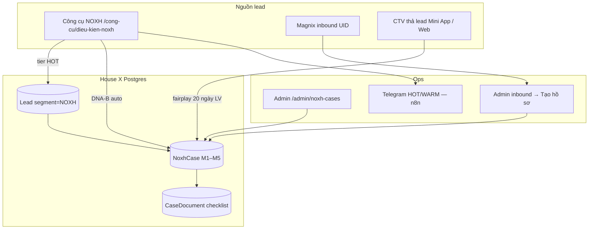

# House X — NOXH Case Pipeline (DNA Ops)

> **Store of record:** Postgres (`noxh_cases`, `case_documents`, …) — ADR-013.  
> **Liên quan:** [DNA_COMPLETION.md](DNA_COMPLETION.md) · [OPS_BACKUP_MIRROR.md](OPS_BACKUP_MIRROR.md) · [LEAD_ATTRIBUTION_CONFLICT_RULES.md](LEAD_ATTRIBUTION_CONFLICT_RULES.md) · `lib/noxh-case/`

---

## 1. Mục tiêu DNA

| Nguyên tắc | Thực thi |
|------------|----------|
| CTV **giới thiệu & theo dõi**, không tư vấn trực tiếp | Contact Firewall — mask SĐT |
| Ops **lọc hồ sơ** trước khi nộp CĐT | Admin milestone + checklist giấy tờ |
| Magnix inbound **không auto-gán CTV** | Ops tạo case thủ công từ inbound |
| Wizard HOT **auto hồ sơ Ops** (DNA-B) | `POST /api/tools/noxh-eligibility` tier HOT |

---

## 2. Luồng tổng



---

## 3. Milestone M1 → M5

| Mốc | Ý nghĩa | CTV thấy |
|-----|---------|----------|
| **M1_RECEIVED** | Nhận hồ sơ, hẹn liên hệ Ops | Tiến độ + % giấy tờ |
| **M2_DOCUMENTS** | Thu thập / rà checklist | Danh sách thiếu + gợi ý hành động |
| **M3_SUBMITTED** | Đã nộp CĐT / ngân hàng | Cập nhật qua notification |
| **M4_APPROVED** | Phê duyệt sơ bộ | idem |
| **M5_SIGNED** | Ký HĐMB → commission ACCRUED | Thông báo hoa hồng dự kiến |

**Ops đổi milestone:** Admin → `/admin/noxh-cases` → chọn hồ sơ → milestone + ghi chú.  
Event `noxh_case.milestone_changed` → notification in-app CTV (nếu đã claim).

---

## 4. DNA-B — Wizard tier HOT → auto case

Khi khách hoàn thành công cụ NOXH và engine trả **tier HOT**:

1. Tạo `Lead` (`source=tool:noxh-check`, `segment=NOXH`)
2. Outbox `lead.noxh_checked` → n8n Telegram HOT (đã có)
3. **Auto** `createPlatformNoxhCase` — `brokerId = null`, M1, checklist theo `objectGroup` + vay
4. Outbox `noxh_case.created`
5. API trả thêm `noxhCaseCode` (nếu tạo thành công)

**Không auto:** WARM / COLD / OUT — chỉ nurture + Sheet detail.

**Env:**

```env
# Mặc định true — tắt khi test local không muốn tạo case
NOXH_WIZARD_HOT_AUTO_CASE=true
```

**Idempotent:** Submit trùng SĐT/lead đã có case → trả `noxhCaseCode` case hiện có, không lỗi.

---

## 5. CTV claim (fairplay)

| Rule | Giá trị |
|------|---------|
| Lock attribution | **20 ngày làm việc** từ claim (`CTV_CLAIM_LOCK_BUSINESS_DAYS`) |
| Lead sàn “active” | Ops `CONTACTED+` trong 20 ngày → CTV khác **không** claim được |
| Self-referral | CTV không claim SĐT trùng SĐT broker |
| Đóng băng vĩnh viễn | Khi `UnitBooking` chuyển cọc (`convertedAt`) |
| Unlock dịch vụ | LMS `NOXH_CLAIM` — đậu «Đào tạo hội nhập CTV» |

**Contact Firewall (CTV / Mini App):**

| Field | CTV |
|-------|-----|
| Họ tên | Đầy đủ |
| SĐT | `0903***678` |
| Email / tin nhắn gốc | Ẩn |

**Entry CTV:** Web `/moi-gioi/ho-so` · Mini App `/agent/ho-so` → «Thả lead».

---

## 6. Magnix inbound → Ops (không auto CTV)

1. Admin → **Inbound leads** (`/admin/inbound-leads`)
2. Chọn UID → nhập SĐT khách sau khi liên hệ ngoài hệ thống
3. «Tạo lead sàn» (nếu chưa)
4. «Tạo hồ sơ NOXH» — gắn `inboundLeadId`, cập nhật meta `noxh_case_code`

---

## 7. Commission (tóm tắt)

| Sự kiện | Trạng thái |
|---------|------------|
| M5 ký HĐMB | `ACCRUED` |
| Ops xác nhận payable | `PAYABLE` |
| Cron ngày **05 & 20** | `PAID` batch |

Cron: `GET /api/cron/commission-payouts` (cần `CRON_SECRET`).

---

## 8. Cron VPS bắt buộc

```bash
cd Proptech-HouseX && npm run go-live:print-cron
```

| Job | Tần suất |
|-----|----------|
| `noxh-case-maintenance` | Mỗi giờ — release lock 20 ngày, SLA M1 |
| `commission-payouts` | 05 & 20 hàng tháng |
| `dispatch-events` | Mỗi phút — outbox → n8n |
| `sheet-mirror` | 6h — tab `ops_mirror` (optional) |

---

## 9. Smoke test DNA

### A — Wizard HOT (DNA-B)

1. `/cong-cu/dieu-kien-noxh` — profile đủ điều kiện + SĐT thật test
2. Response API có `tier: "HOT"` và `noxhCaseCode: "HX-NOXH-..."`
3. Admin `/admin/noxh-cases` — thấy hồ sơ M1, `brokerId` trống
4. Telegram HOT (n8n) — ping chat chuyên gia

### B — CTV claim

1. CTV đã unlock `NOXH_CLAIM`
2. Mini App → thả lead SĐT mới
3. Admin đổi milestone → CTV notification + chi tiết hồ sơ

### C — Inbound

1. Admin inbound → tạo case → meta có `noxh_case_code`

---

## 10. Lộ trình DNA tiếp

| Batch | Trạng thái |
|-------|------------|
| **DNA-D** | Zalo OA CS → CTV khi milestone (outbox `noxh_case.milestone_changed`) |
| **P4** | Subdomain campaign links (Mini App two lanes) |

### C — Zalo OA (tùy chọn — không chặn MVP)

1. CTV login Mini App → có `zaloUserId` + follow OA (khi cần quảng bá)
2. **Mặc định:** milestone/conflict → **in-app only** (`ZALO_OA_NOTIFY_ENABLED=false`)
3. Khi bật OA: Admin đổi milestone → outbox có thể gửi thêm tin OA (DNA-D)
4. Chiến dịch quảng bá → OA Broadcast / template (phase marketing, không dùng pipeline Ops)

---

*Cập nhật: 2026-07-09 — DNA-A/B/C/D.*
