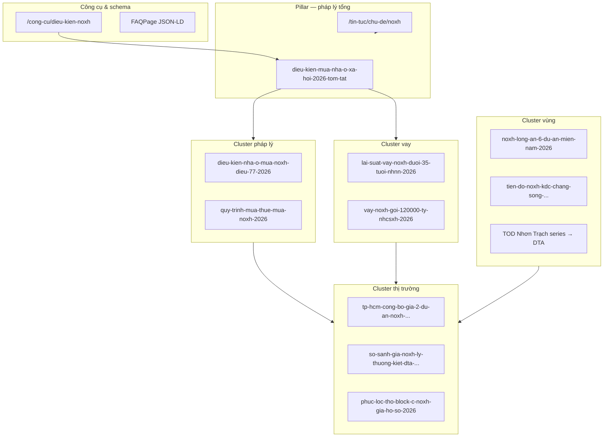

# Kiến trúc nội dung NOXH — AIO & SEO (HouseX)

> Trạng thái: **Accepted** · Cập nhật 07/2026  
> Phạm vi: `/tin-tuc`, `/tin-tuc/chu-de/noxh`, `/du-an?projectType=NHA_O_XA_HOI`, `/cong-cu/dieu-kien-noxh`

## 1. Mục tiêu

Xây **content hub** nhà ở xã hội phục vụ:

1. **SEO** — long-tail theo chủ đề pháp lý, vay, quy trình, từng dự án/vùng.
2. **AIO** — H2 dạng câu hỏi, trích Điều luật, bảng/bullet, FAQPage JSON-LD (tool + hub).
3. **Chuyển đổi** — nội bộ link tới `/du-an/`, `/cong-cu/`, `/lien-he` (Value-First, không hard sell).

## 2. Mô hình Pillar + Cluster

## 3. Inventory (runtime demo catalog)

| Vai trò | Slug | Tag chính |
|---------|------|-----------|
| Pillar | `dieu-kien-mua-nha-o-xa-hoi-2026-tom-tat` | `noxh`, `phap-ly` |
| Cluster pháp lý | `dieu-kien-nha-o-mua-noxh-dieu-77-2026` | `noxh`, `phap-ly` |
| Cluster pháp lý | `quy-trinh-mua-thue-mua-noxh-2026` | `noxh`, `phap-ly` |
| Cluster vay | `vay-noxh-goi-120000-ty-nhcsxh-2026` | `noxh`, `phap-ly` |
| Cluster vay | `lai-suat-vay-noxh-duoi-35-tuoi-nhnn-2026` | `noxh`, `phap-ly` |
| Thị trường TP.HCM | `tp-hcm-cong-bo-gia-2-du-an-noxh-...` | `noxh`, `tien-do-du-an` |
| So sánh | `so-sanh-gia-noxh-ly-thuong-kiet-dta-...` | `noxh`, `dau-tu` |
| Dự án LTK | `gia-nha-o-xa-hoi-ly-thuong-kiet-...` | `nha-o-xa-hoi-ly-thuong-kiet` |
| Dự án PLT | `phuc-loc-tho-block-c-noxh-gia-ho-so-2026` | `noxh`, `tien-do-du-an` |
| Vùng Long An | `noxh-long-an-6-du-an-mien-nam-2026` | `noxh`, `goc-chuyen-gia` |
| Vùng Đồng Nai | `tien-do-noxh-kdc-chang-song-...` | `noxh` |
| TOD → DTA | 5 bài `tod-nhon-trach-series-2026` | `do-thi-ve-tinh-tod` + `noxh` |

**Nguồn code:** `lib/content/articles/noxh-knowledge-series-2026.ts`, `noxh-trend-series-2026.ts`, `tod-nhon-trach-series-2026.ts`, `lib/preview/demo-articles.ts`.

## 4. Chuẩn biên tập (AIO)

| Quy tắc | Chi tiết |
|---------|----------|
| H2 | Câu hỏi hoặc nhận định — không heading meta/prompt |
| Độ dài cluster | 3–5 section `##`, 800–1.500 từ |
| Trích pháp lý | Điều/khoản + link vanban.chinhphu.vn |
| Liệt kê | Bullet hoặc bảng — không wall of text |
| Kết bài | `NOXH_SUPPORT_CLOSING` hoặc trích nguồn + link cluster |
| QA | L0 `assertEditorialBodyQuality` · L2 `/devil` NOXH/vay · L3 human publish |
| Schema | BlogPosting mọi bài · FAQPage trên tool + hub `noxh` |

## 5. Liên kết dự án

| Project slug | Featured articles (ưu tiên) | Tag hub |
|--------------|----------------------------|---------|
| `nha-o-xa-hoi-ly-thuong-kiet` | trend 01, gia LTK, so sánh | `nha-o-xa-hoi-ly-thuong-kiet` |
| `dta-happy-home-nhon-trach` | TOD series, vay, so sánh | `dta-happy-home-nhon-trach` |
| `chung-cu-phuc-loc-tho-noxh` | PLT article, TP.HCM trend | `noxh` |
| `noxh-kdc-chang-song-phuoc-tan` | tiến độ Chàng Sông | `noxh` |
| Long An (6 slug) | `noxh-long-an-6-du-an-...` | `noxh` |

Cấu hình: `lib/content/project-related-articles.ts`.

## 6. Lộ trình bổ sung (backlog)

| Ưu tiên | Chủ đề | Ghi chú |
|---------|--------|---------|
| P1 | Eco Residence, Dragon E-Home, Thu Thiem Green House | Có landing, chưa có bài |
| P1 | Nam Long Cần Thơ (2 dự án) | Regional gap |
| P2 | Điều 67 — quân nhân/công an | Deep dive |
| P2 | Chuyển nhượng / thời hạn sở hữu NOXH | AIO pháp lý |
| P2 | Thuê mua vs mua — Điều 78 | Finance/legal |
| P3 | FAQPage JSON-LD trên pillar article page | Bổ sung schema article |
| P3 | Seed Prisma đồng bộ full catalog | Sitemap DB |

## 7. Pipeline vận hành

1. **Sinh nội dung:** n8n + prompt `housex__website-article-pr.md` → Sheet.
2. **QA L0:** `npm test` — `article-editorial-voice.test.ts`.
3. **Publish:** thêm vào series TS hoặc `/admin/articles`.
4. **Registry:** cập nhật `PROJECT_FEATURED_ARTICLE_SLUGS` khi có bài mới gắn dự án.
