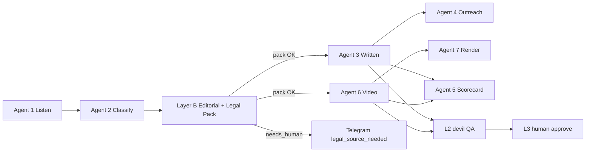

# Magnix Legal Gate Pipeline

> Mục tiêu bắt buộc: **8 agent + workflow content không được soạn nội dung hay kịch bản sai pháp lý.** Mọi claim NOXH / vay / định giá phải đi qua Layer K (Legal KB) trước khi LLM viết bản publish.

## 1. Nguyên tắc

1. **Không suy luận pháp lý** ngoài `legal_retrieval_pack` đã retrieve từ `legal-sources/`.
2. **Layer B (Editorial Brief)** là điểm inject pack chính — ghi vào `content_queue.meta.legal_retrieval_pack`.
3. **Agent 3, 4, 6** chỉ chạy production khi pack đủ và `needs_human_legal_source !== true`.
4. Thiếu căn cứ → `needs_human_legal_source` + Telegram `legal_source_needed` (xem `docs/TELEGRAM_APPROVAL_NOTIFICATIONS.md`).
5. Nội dung nhạy cảm → L2 `/devil` trước L3 publish (`.cursor/QA_TIERS.md`).

## 2. Sơ đồ pipeline



## 3. Ma trận 8 agent — Legal Gate

| # | Agent | Workflow | Legal gate | Hành vi bắt buộc |
|---|-------|----------|------------|------------------|
| 1 | Social Listening | `social-listening` (+ FB) | **Tag** | Gắn `detected_need: legal_confusion` khi pain hỏi điều kiện / vay / hồ sơ; không viết claim pháp lý |
| 2 | Classify | `content-classify` | **Route** | Set `requires_legal_kb: true` cho `noxh_income`, `valuation`, `sme_credit`; map `legal_topic` |
| — | **Layer B** | `content-editorial-brief` | **Inject** | Node `Attach Legal Pack` → `meta.legal_retrieval_pack`; block downstream nếu `needs_human_legal_source` |
| 3 | Lead Magnet / Written | `content-draft` | **Consume** | Prompt chỉ dùng facts trong pack; `source_refs[]` từ `claim_id`; không pack → skip + notify |
| 4 | Outreach | `outreach-queue` | **Consume** | Tin Zalo/DM không hứa duyệt / lãi suất; segment pháp lý cần pack từ meta queue |
| 5 | Scorecard | `content-scorecard` | **Audit** | Flag output thiếu `source_refs` hoặc claim ngoài pack |
| 6 | Video Script | `content-video-draft` | **Consume** | `spoken` / `on_screen` tuân `forbidden_claims`; pack bắt buộc như Agent 3 |
| 7 | Video Render | `content-video-render` | **L0** | Kiểm text on-screen / caption không vi phạm forbidden; không thêm claim mới |
| 8 | *(ops)* | `telegram-notify` / `reminder` | **Escalate** | `legal_source_needed` SLA 1h / 4h / 12h |

> **uid-ingest** dùng cùng rule classify Agent 2 — không phải agent content thứ 9.

## 4. Segment → Legal topic

| `segment` (Agent 2) | `requires_legal_kb` | `legal_topic` |
|---------------------|---------------------|---------------|
| `noxh_income` | true | `noxh_income` |
| `valuation` | true | `valuation_certificate` |
| `sme_credit` | true | `loan_dti` |
| `general_inbound` | false | — |

Resolver: `n8n-workflows/code/shared/legal-gate-config.js` · Builder: `scripts/build-legal-pack-bundle.mjs`.

## 5. Contract `legal_retrieval_pack`

Schema đầy đủ: `docs/LEGAL_KB_ARCHITECTURE.md` §3.4.

Trường tối thiểu workflow phải kiểm:

| Field | Gate |
|-------|------|
| `facts[]` | ≥1 fact với `claim_id`, `source_refs` |
| `forbidden_claims[]` | LLM + L0 không được vi phạm |
| `disclaimer_required` | Output phải có disclaimer |
| `needs_human_legal_source` | `true` → **không** chạy Agent 3/4/6; fire Telegram |

## 6. Ba kênh phân phối

| Kênh | Agent / script | Legal pack |
|------|----------------|------------|
| AIO / SEO (website, Page) | Agent 3, 6 | `legal-channel-pack.mjs` → `aio_seo` + retrieval pack |
| Inbox counseling (Page chat) | *(planned)* `noxh-application-draft` | `inbox_counseling` + rule engine §Điều 76 |
| Staff ops (mẫu hồ sơ) | *(internal)* | `staff_ops` — không qua LLM content publish |

Chi tiết: `docs/NOXH_THREE_CHANNEL_ARCHITECTURE.md`.

## 7. Thứ tự triển khai (checklist)

- [x] Legal KB L3 human-verified (`legal-sources/noxh/`)
- [x] `scripts/lib/legal-retrieval-pack.mjs`
- [x] Bundle cho n8n VPS: `scripts/build-legal-pack-bundle.mjs` → `n8n-workflows/legal-pack-bundle.json`
- [x] Layer B node **Attach Legal Pack**
- [x] Agent 3 / 6 đọc pack từ `meta`
- [x] **Page Publish** workflow `content-page-publish` — xem `docs/CONTENT_PAGE_PUBLISH_SETUP.md`
- [ ] Agent 4 outreach đọc pack (filter + prompt)
- [ ] Agent 5 scorecard audit `source_refs` vs pack
- [ ] Workflow inbox `noxh-application-form-draft` (kênh 2)
- [ ] L2 automated claim-outside-pack check

## 8. Deploy sau thay đổi legal

```powershell
node scripts/build-legal-pack-bundle.mjs
node scripts/rebuild-all-workflows.mjs
node scripts/push-n8n-workflows.mjs
```

## 9. Tài liệu liên quan

- `docs/LEGAL_KB_ARCHITECTURE.md` — Layer K schema
- `docs/CONTENT_PRODUCT_OUTPUTS.md` — product object + `legal_retrieval_pack`
- `n8n-workflows/MAGNIX_AGENTS_REGISTRY.md` — cron 8 agent
- `n8n-workflows/WORKFLOW_REGISTRY.md` — cột Legal gate
- `ARCHITECTURE_MAGNIX.md` §3.2 — inbound production
