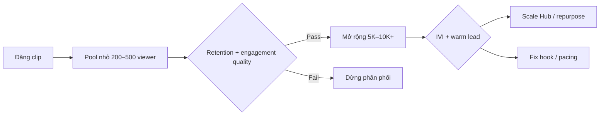

# Nghiên cứu tín hiệu nền tảng — Magnix Social Discovery Layer

> **Mục tiêu:** Thay cảm tính bằng rubric đo được — tín hiệu thuật toán, benchmark, và chỉ số inbound (opt-in) trên TikTok, Facebook Page/Reels, YouTube Shorts.
>
> **Tool đi kèm:** `tools/content-scorecard/` — chấm điểm pre-publish và post-publish theo file này.
>
> **Cập nhật:** 2026-06-22 · Review định kỳ 90 ngày (thuật toán thay đổi liên tục).

---

## 1. Nguyên tắc Magnix

| Nguyên tắc | Ý nghĩa vận hành |
|------------|------------------|
| **Retention > vanity** | View/follow không phải KPI chính; completion, save, keyword comment mới quyết định scale |
| **Segment virality** | Viral trong pain universe (NOXH, vay, pháp lý) — không drama/meme ngoài segment |
| **Hub + Spoke** | Spoke (TikTok) test hook; Hub (Page/Zalo) giữ opt-in; mọi tín hiệu → Google Sheet |
| **Evidence loop** | Pre-publish rubric → post 24–72h analytics → scorecard → scale/fix/kill |

**Inbound Virality Index (IVI)** — chỉ số Magnix gộp reach và chuyển đổi:

```
IVI = (keyword_comments + dm_opt_in + form_submit) / reach × 100
Warm lead rate = UID score ≥ 60 / total UID from post
```

Clip “viral” nhưng IVI thấp → **không scale**; clip reach vừa nhưng IVI cao → **ưu tiên repurpose Hub**.

---

## 2. Cơ chế chung (cold-start batch testing)

Ba nền tảng short-form đều dùng mô hình **test pool → mở rộng nếu retention tốt**:



**Hệ quả kỹ thuật:**
- **3 giây đầu** quyết định batch expansion — không phải follower count
- **Completion/APV** nặng hơn like
- **Save + share (đặc biệt DM share)** = tín hiệu chất lượng cao
- **Search/keyword** (caption, spoken word, on-screen text) ngày càng quan trọng cho discovery

---

## 3. TikTok — tín hiệu & benchmark

### 3.1 Nguồn tham chiếu

| Nguồn | Loại | Link |
|-------|------|------|
| TikTok Transparency — How recommendations work | Primary (official) | https://www.tiktok.com/transparency/en/recommendation-system |
| Hootsuite — TikTok algorithm 2026 | Secondary synthesis | https://blog.hootsuite.com/tiktok-algorithm/ |
| TikTok Creator Academy | Official education | https://www.tiktok.com/creators/creator-portal/ |

### 3.2 Ranking signals (thứ tự ước lượng trọng số)

| # | Signal | Mô tả kỹ thuật | Magnix action |
|---|--------|----------------|---------------|
| 1 | **Completion rate** | % xem hết clip | Mục tiêu ≥70% (clip 15–60s); cắt fluff nếu <60% |
| 2 | **Rewatch / loop** | Xem lại ≥1 lần | End card gợi ý replay; checklist 5 mục dễ xem lại |
| 3 | **Watch time (absolute)** | Tổng giây xem | 60s OK nếu retention cao; không kéo dài khi retention tụt |
| 4 | **Early swipe-away** | Thoát trong 1–3s | Hook visual + text ngay frame 0; tránh intro “Xin chào…” |
| 5 | **Shares + saves** | Share > like | CTA “Lưu checklist” / “Gửi người đang mua NOXH” |
| 6 | **Comment depth** | Comment có nội dung | Keyword trigger: CHECKLIST, NOXH, DTI |
| 7 | **Search relevance** | Caption + speech + OCR text | Nói rõ từ khóa pain trong 5s đầu |
| 8 | **Profile visit** | Click profile sau xem | Bio link form + keyword nhất quán |

### 3.3 Benchmark vận hành (Spoke — discovery)

| Metric | Poor | Average | Good | Scale |
|--------|------|---------|------|-------|
| Completion rate | <40% | 40–60% | 60–70% | **≥70%** |
| Rewatch rate | <5% | 5–10% | 10–15% | **≥15%** |
| Save rate | <1% | 1–2% | 2–4% | **≥4%** |
| Share rate | <0.5% | 0.5–1% | 1–2% | **≥2%** |
| Keyword comment rate | <0.3% | 0.3–0.8% | 0.8–1.5% | **≥1.5%** |

### 3.4 Spec kỹ thuật clip TikTok (Magnix)

| Yếu tố | Chuẩn |
|--------|-------|
| Tỷ lệ | 9:16, 1080×1920 |
| Độ dài Spoke | 21–45s (sweet spot retention) |
| Hook | Text on-screen + verbal trong 0–1.5s |
| Pattern interrupt | Mỗi 3–5s: cut, zoom, text mới, B-roll |
| Caption | 80–150 ký tự + 3 hashtag ngách + từ khóa search |
| Audio | Voice rõ; music nhẹ không lấn speech |
| CTA | Comment keyword (không link đầu caption) |

---

## 4. Facebook Reels — tín hiệu & benchmark

### 4.1 Nguồn tham chiếu

| Nguồn | Loại | Link |
|-------|------|------|
| Meta Transparency — Facebook Reels ranking | Primary (official) | https://transparency.meta.com/features/explaining-ranking/fb-reels/ |
| Meta Engineering — UTIS model (Jan 2026) | Primary (research) | https://engineering.fb.com/2026/01/14/ml-applications/adapting-the-facebook-reels-recsys-ai-model-based-on-user-feedback/ |

### 4.2 Ranking signals

| # | Signal | Mô tả | Magnix action |
|---|--------|-------|---------------|
| 1 | **Watch >10s fullscreen** | Meta predict likelihood | Hook phải giữ fullscreen, không letterbox mờ |
| 2 | **Completion** | Xem đến cuối | Reels Hub: 30–45s, một insight một clip |
| 3 | **Rewatch / loop** | Loop factor ~1.5× | End loop mượt (câu mở → câu đóng) |
| 4 | **UTIS interest match** (2026) | Survey “video có match interest?” | **Một segment/một mood** — tránh generic BĐS |
| 5 | **Share via DM** | Share chất lượng cao | “Gửi vợ/chồng đang tính vay” framing |
| 6 | **Negative signals** | Hide, not interested | Không title clickbait sai pain |
| 7 | **Recency velocity** | Boost 12–24h đầu | Đăng khi audience online; không edit caption sau 1h |

**UTIS (User True Interest Survey):** Meta bổ sung lớp survey trực tiếp — clip completion cao nhưng **không match interest** (style/topic/mood) sẽ bị cap distribution. Magnix: giữ **production style nhất quán** trên Page (giáo dục, calm authority, không nhảy mood).

### 4.3 Benchmark Reels

| Metric | Poor | Average | Good | Scale |
|--------|------|---------|------|-------|
| 3s retention | <50% | 50–65% | 65–75% | **≥75%** |
| 50% mark retention | <35% | 35–45% | 45–55% | **≥50%** |
| Completion | <30% | 30–45% | 45–55% | **≥55%** |
| Loop factor | <1.1 | 1.1–1.3 | 1.3–1.5 | **≥1.5** |
| IVI | <0.5% | 0.5–1% | 1–2% | **≥2%** |

### 4.4 Facebook Page (feed không phải Reels tab)

Page feed 2026 thiên **meaningful interactions** và **conversation**:

| Signal | Magnix action |
|--------|---------------|
| Comment thread depth | Hỏi 1 câu cụ thể cuối post (thu nhập, khu vực) |
| Share | Checklist carousel dễ share |
| Click link (giảm organic) | Ưu tiên comment keyword → DM automation |
| Video watch time (in-feed) | 60–90s max; subtitle bắt buộc |
| Native upload | Upload trực tiếp, không link YouTube |

---

## 5. YouTube Shorts — tín hiệu & benchmark

### 5.1 Nguồn tham chiếu

| Nguồn | Loại | Link |
|-------|------|------|
| YouTube Creator Insider (Shorts product) | Primary (official channel) | https://www.youtube.com/creatorinsider |
| YouTube Help — Shorts analytics | Primary | https://support.google.com/youtube/answer/121461?hl=en |

### 5.2 Ranking signals

| # | Signal | Mô tả | Magnix action |
|---|--------|-------|---------------|
| 1 | **Viewed vs Swiped Away** | % dừng xem vs swipe | Mục tiêu **≥70% viewed** |
| 2 | **APV (Avg % Viewed)** | % clip được xem | Mục tiêu **≥80%**; >100% = loop tốt |
| 3 | **Explore → Exploit** | Seed audience test | 3–5 Shorts cùng niche liên tục để train channel DNA |
| 4 | **Engaged views** | View có commitment (2025+) | Không chase raw view count |
| 5 | **Comments + remix** | Tương tác sâu | Pin comment FAQ + keyword |
| 6 | **Session continuation** | Xem Short tiếp theo | Series “5 lỗi NOXH” phần 1/5 |

### 5.3 Benchmark Shorts

| Metric | Poor | Average | Good | Scale |
|--------|------|---------|------|-------|
| Viewed (not swiped) | <50% | 50–65% | 65–75% | **≥70%** |
| APV | <50% | 50–70% | 70–80% | **≥80%** |
| Swipe-away (3s) | >50% | 35–50% | 25–35% | **≤30%** |
| IVI | <0.3% | 0.3–0.8% | 0.8–1.5% | **≥1.5%** |

### 5.4 Spec kỹ thuật Shorts

| Yếu tố | Chuẩn |
|--------|-------|
| Độ dài | 30–58s (Magnix); tối đa 3 phút nhưng chỉ khi APV ổn |
| First frame | Static compelling frame — không fade in chậm |
| Title (upload) | Câu hỏi search: “Thu nhập 15tr có vay NOXH được không?” |
| Hashtag | #NOXH #vaymuanha + 1 branded |
| End screen | Verbal CTA + text 2s cuối |

---

## 6. Ma trận so sánh nền tảng

| Yếu tố | TikTok (Spoke) | FB Reels (Hub) | YT Shorts (optional) | FB Page post |
|--------|----------------|----------------|----------------------|--------------|
| KPI retention chính | Completion ≥70% | Loop + UTIS fit | Viewed ≥70%, APV ≥80% | Watch time + comments |
| Vai trò Magnix | Test hook | Convert + trust | SEO video search | Longer Q&A, carousel |
| CTA ưu tiên | Comment keyword | Keyword + form link bio | Comment + subscribe | Comment → DM |
| Độ dài khuyến nghị | 21–45s | 30–45s | 30–58s | 60–90s / carousel |
| Đăng tần suất test | 4–5/tuần | 3–4/tuần | 2–3/tuần | 2–3/tuần |
| Rủi ro compliance | Cao nếu claim số | Cao — Page brand | Trung bình | Thấp hơn (dài, disclaimer) |

---

## 7. Pre-publish rubric (trước khi đăng)

Tool `content-scorecard` chấm **12 hạng mục kỹ thuật** (0–100). Ngưỡng publish:

| Điểm | Hành động |
|------|-----------|
| ≥75 | OK publish (Spoke test) |
| 60–74 | Sửa hook/pacing rồi publish |
| <60 | Không publish — refactor script |

### 7.1 Checklist 12 hạng mục

| ID | Hạng mục | Trọng số | Pass criteria |
|----|----------|----------|---------------|
| H1 | Hook 0–3s | 15% | Pain + pattern interrupt, không intro |
| H2 | Segment clarity | 10% | NOXH/vay/SME/valuation rõ trong 5s |
| H3 | Pattern interrupt density | 8% | ≥1 interrupt / 5s |
| H4 | On-screen text | 8% | Keyword + subtitle readable mobile |
| H5 | Length vs platform | 7% | Trong sweet spot (§3.4, 4.3, 5.4) |
| H6 | Audio clarity | 5% | Speech intelligible, music không lấn |
| H7 | Search keywords | 10% | Caption + speech có từ khóa pain |
| H8 | Save/share framing | 8% | Có lý do lưu/gửi (checklist, bảng) |
| H9 | CTA opt-in | 12% | Keyword comment hoặc DM trigger |
| H10 | Loop/rewatch design | 7% | End mở hoặc loop visual |
| H11 | Compliance | 10% | Không hứa lãi/giá/duyệt chắc |
| H12 | Repurpose ready | 10% | Có thể atomize sang Hub/blog |

---

## 8. Post-publish scorecard (24–72h)

Thu metrics từ analytics native → nhập JSON vào tool hoặc n8n.

### 8.1 Verdict engine

| Verdict | Điều kiện |
|---------|-----------|
| **scale** | Retention ≥ “Good” AND IVI ≥ Good AND warm lead rate ≥40% |
| **fix** | Retention Good nhưng IVI Poor — sửa CTA/keyword |
| **kill** | Retention Poor — hook/pacing fail, không repurpose |
| **hub_candidate** | Spoke scale + IVI cao → repurpose sang Page với lead magnet |

### 8.2 Chu kỳ review

| Khi | Việc |
|-----|------|
| +24h | Retention + swipe/completion |
| +72h | IVI + keyword comments + DM |
| Weekly | Top 3 scale, bottom 3 kill, A/B hook report |
| Quarterly | Cập nhật benchmark file `platform-signals.json` |

---

## 9. Tích hợp Magnix pipeline

```
Brief → copywriter script → pre-publish score (CLI) → L2 QA nếu nhạy cảm
  → Publish Spoke/Hub → Analytics 72h → post-publish score
  → n8n__content-performance-analyze (LLM) → Google Sheet status + next action
```

| Artifact | Vị trí |
|----------|--------|
| Research (file này) | `docs/PLATFORM_VIRAL_RESEARCH.md` |
| Benchmarks machine-readable | `tools/content-scorecard/platform-signals.json` |
| CLI scorer | `tools/content-scorecard/score.mjs` |
| LLM analyze prompt | `ai-agents-prompts/n8n__content-performance-analyze.md` |
| Golden tests | `tests/fixtures/content-scorecard/` |

---

## 10. Giới hạn & cảnh báo

1. **Benchmark không phải công thức chính thức** — TikTok/Meta/YouTube không công bố trọng số chính xác; số trong doc là ngưỡng vận hành tổng hợp từ tài liệu công khai + Creator analytics.
2. **UTIS (Meta 2026)** — style/mood match quan trọng hơn trước; tránh đăng clip lệch tone Page.
3. **Magnix không tối ưu view thuần** — clip 100K view, IVI 0.1% = thất bại inbound.
4. **Review 90 ngày** — ghi changelog cuối file khi cập nhật benchmark.

### Changelog

| Ngày | Thay đổi |
|------|----------|
| 2026-06-22 | Khởi tạo v1 — TikTok, FB Reels/Page, YT Shorts + IVI + tool scorecard |
