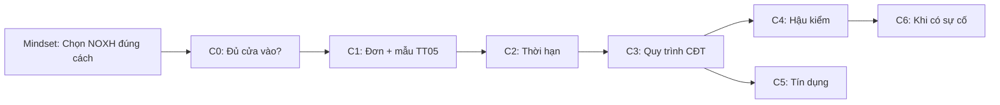

# Lộ trình nội dung cẩm nang NOXH — Hành trình hồ sơ (C0–C6)

> **Trạng thái:** `draft_internal` — 2026-07-16 · Chưa publish — map slug → nguồn KB  
> **Taxonomy mẫu:** `NOXH_FORM_TAXONOMY.md` (bắt buộc đọc trước khi viết bài)  
> **Tag HouseX:** `chinh-sach-ho-so-noxh` (`/tin-tuc/cam-nang-noxh/chu-de/chinh-sach-ho-so-noxh`)  
> **Tool:** `/cong-cu/dieu-kien-noxh` · `/cong-cu/kiem-tra-vay-noxh`

---

## Funnel đọc (gợi ý trên hub)

**Mindset** (tag `chon-noxh-dung-cach`) đứng **trước** C0 — đã có 15 bài publish; không trùng lặp trong map này.

---

## Bảng cluster → bài → nguồn

| Cluster | Ưu tiên | Slug đề xuất | Tiêu đề AIO (H2 dạng câu hỏi) | Nguồn KB / ghi chú | Trạng thái |
|---------|---------|--------------|-------------------------------|---------------------|------------|
| **C0** | P0 | `dieu-kien-nha-o-noxh-3-tinh-huong-hay-bi-tra-ho-so` | Điều kiện nhà ở NOXH: Ba tình huống hay bị trả hồ sơ? | `application-form-mau-01-guide.md` Phần D · Đ.29 NĐ 100 | backlog |
| **C0** | P0 | *(pillar hiện có)* `dieu-kien-mua-nha-o-xa-hoi-2026-tom-tat` | Tóm tắt điều kiện mua NOXH 2026 | `demo-articles` / knowledge series | published |
| **C1** | P0 | `mau-01-don-dang-ky-noxh-cach-dien-tranh-loi` | Điền đơn Mẫu 01 NOXH thế nào để tránh bị trả hồ sơ? | `application-form-mau-01-guide.md` | backlog |
| **C1** | P0 | `mau-04-mau-05-xac-nhan-thu-nhap-noxh-2026` | Mẫu 04 và Mẫu 05 (TT-BXD): Khai thu nhập mua NOXH đúng thế nào? | `mau-01-section-11-income.md` · `NOXH_FORM_TAXONOMY.md` | backlog |
| **C1** | P1 | `mau-02-mau-03-dieu-kien-nha-o-noxh` | Mẫu 02 và Mẫu 03: Chứng minh điều kiện nhà ở NOXH ra sao? | `application-form-mau-01-guide.md` · TT 05 Đ.7 | backlog |
| **C1** | P1 | `llvt-k7-ho-so-noxh-mau-bqp-bca` | Quân nhân, công an (k7) nộp hồ sơ NOXH dùng mẫu gì? | `income-exemption-and-llvt-counseling.md` | backlog |
| **C1** | P1 | `bao-nhieu-bo-ho-so-photo-noxh` | Nộp hồ sơ NOXH cần chuẩn bị mấy bộ? | `application-dossier-checklist.md` | published |
| **C2** | P1 | `thoi-han-12-thang-giay-xac-nhan-noxh` | Giấy xác nhận NOXH có hiệu lực bao lâu? | NĐ 54 Đ.38 · atomic claims | backlog |
| **C3** | P1 | *(có)* `quy-trinh-mua-thue-mua-noxh-2026` | Quy trình mua/thuê mua NOXH 2026? | `noxh-knowledge-series-2026.ts` | published |
| **C4** | **P0** | `hau-kiem-noxh-doi-chieu-bhxh-thue-2026` | Hậu kiểm hồ sơ NOXH: Dữ liệu thuế và BHXH được đối chiếu thế nào? | atomic batch2 · case Đồng Nai | backlog L3 |
| **C4** | P0 | `bai-hoc-thanh-tra-noxh-dong-nai-2026` | Bài học từ kết luận thanh tra tại Đồng Nai 06/2026 | [Thanh tra 09/07/2026](https://thanhtra.com.vn/ket-luan-thanh-tra-E17BD7A25/thanh-tra-tp-dong-nai-phat-hien-nhieu-bat-thuong-ho-so-mua-nha-o-xa-hoi-818acf2ed.html) · KL **09/KL-TT** 19/6/2026 | published |
| **C5** | — | *(cụm vay hiện có)* | Xem `noxh-loan-cluster-map-2026.ts` | 10 bài + pillar — **không viết lại** | published |
| **C5** | P1 | `room-tin-dung-noxh-va-30-von-tu-co` | Mua NOXH cần chuẩn bị bao nhiêu vốn tự có? Room tín dụng là gì? | `bank-credit-appraisal-counseling.md` | backlog |
| **C6** | P2 | `bi-loai-ho-so-noxh-lam-gi-tiep-theo` | Bị loại hoặc không được ký HĐ NOXH — làm gì tiếp theo? | NĐ 54 Đ.38 · Luật Khiếu nại 2011 · **không** quy trình NOXH riêng | backlog |

---

## Kết luận thanh tra Đồng Nai — fact sheet publish (L3)

**Nguồn công khai:** Báo Thanh tra, 09/07/2026 — tóm tắt KL thanh tra TP Đồng Nai.

| Mục | Nội dung |
|-----|----------|
| Văn bản | Kết luận thanh tra số **09/KL-TT**, ngày **19/6/2026** |
| Phạm vi | 3 dự án NOXH (Long Thành Riverside; Thái Thành–Thuận Lợi; Chương Dương Homeland Long Hưng) |
| Phát hiện | Giấy xác nhận thu nhập **không khớp** BHXH/thuế; DN ký xác nhận nhưng người mua **không có BHXH tại DN**; một số dự án **không bốc thăm** khi vượt quỹ căn; cọc **&gt; 5%** giá bán |
| Kiến nghị | Sở Xây dựng rà soát lại hồ sơ; chuyển điều tra nếu có dấu hiệu hình sự |
| **Không viết** | Kết luận gian lận cá nhân; số liệu hình sự chưa có QĐ tố tụng |

---

## Mục 6.4 — Khung “khiếu nại / giải trình” (trung thực)

Chưa có quy trình tập trung “giải trình khi TMS thuế lệch”. Ghép các luồng:

| Tình huống | Căn cứ | Hành động người mua |
|------------|--------|---------------------|
| Bị công khai “không đủ ĐK”, trả hồ sơ | NĐ 54 sửa Đ.38 — trả trong **15 ngày** | Yêu cầu **lý do bằng văn bản**; bổ sung giấy tờ |
| Có **QĐ hành chính** bất lợi | Luật Khiếu nại **2011** | Khiếu nại lần 1 → lần 2 (90 ngày kể từ khi biết QĐ) |
| Nghi sai phạm CĐT/cán bộ | Luật Tố cáo **2018** | Tố cáo cơ quan có thẩm quyền |
| Dữ liệu thuế/BHXH/cư trú sai | Luật QL thuế · BHXH · Luật Cư trú | **Sửa tại cơ quan nguồn** trước/song song — không chờ “cổng NOXH” |
| CIC sai | FAQ CIC | **1800585891** · `cic-self-check-citizen-guide.md` |
| Sau hậu kiểm, hủy HĐ | Cam kết trung thực NĐ 54 · HĐ CĐT | Tư vấn pháp lý; không cam kết “HouseX giải trình thay Thuế” |

**Disclaimer bài C6:** *Thông tin tham khảo; không thay tư vấn pháp lý. HouseX hỗ trợ đối chiếu checklist, không đại diện khiếu nại thay người mua.*

---

## Internal link bắt buộc (mỗi bài C1–C4)

- Pillar: `/tin-tuc/cam-nang-noxh/chu-de/chinh-sach-ho-so-noxh`
- Tool: `/cong-cu/dieu-kien-noxh`
- C5: `/cong-cu/kiem-tra-vay-noxh` + pillar `tham-dinh-khoan-vay-mua-nha-o-xa-hoi`
- Mindset (nếu FOMO/cọc vội): `checklist-chot-mua-noxh-tai-chinh-ha-tang-cic`

---

## Pipeline publish

1. Sinh brief → n8n / Sheet (`housex__website-article-pr.md`)
2. L0: `article-editorial-voice.test.ts`
3. L2 `/devil` — bài C4, C1 thu nhập, C6
4. L3 human — **bắt buộc** bài Đồng Nai
5. Thêm slug vào `noxh-knowledge-series-2026.ts` hoặc series mới `noxh-handbook-journey-2026.ts`

---

*Cập nhật khi publish từng slug — đổi cột Trạng thái thành `published` + ngày L3.*
