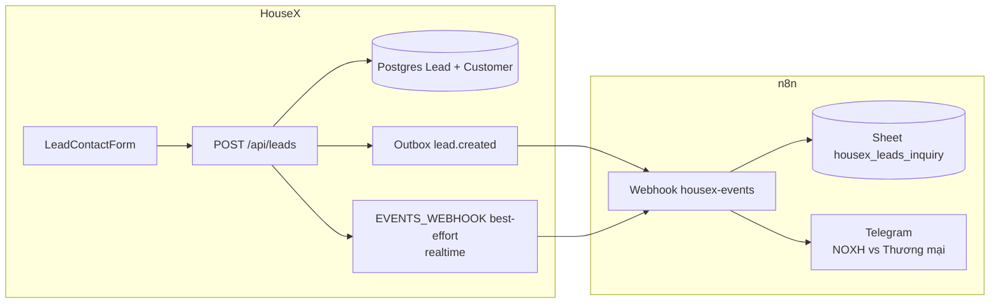
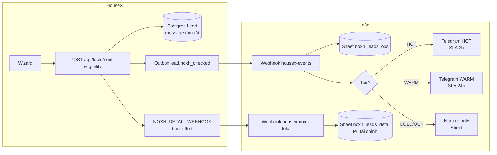

# HouseX — Lead Routing (n8n)

Workflow: **`housex-noxh-lead-route`** (Events Hub) · File: `housex-noxh-lead-route.workflow.json`

Hai luồng lead inbound:

| Luồng | Nguồn | Event | Telegram |
|---|---|---|---|
| **A — Công cụ NOXH** | `/cong-cu/dieu-kien-noxh` | `lead.noxh_checked` | HOT/WARM theo tier |
| **B — Form liên hệ** | `LeadContactForm` trên `/du-an/[slug]`, `/tin-dang/[code]` | `lead.created` | Realtime mọi lead (SLA 2h) |
| **C — Đăng ký khách** | `/dang-ky/khach-hang` | `account.registered` (CUSTOMER) | Telegram ops |
| **D — Đăng ký môi giới** | `/dang-ky/moi-gioi` | `account.registered` (BROKER) | Telegram ops — onboarding 24h |
| **E — Đăng ký CTV** | `/moi-gioi/dang-ky-ctv` | `ctv.application_submitted` | Telegram CTV ops — duyệt 24h |

---

## Luồng B — Form dự án / tin đăng



**HouseX:** `POST /api/leads` enqueue `lead.created` + forward best-effort ngay (outbox vẫn retry nếu lỗi). n8n dedupe theo `lead_id` để tránh ping trùng.

Envelope `lead.created`:

```json
{
  "type": "lead.created",
  "payload": {
    "leadId": "uuid",
    "source": "organic",
    "message": "Muốn tư vấn suất A10",
    "contact": { "name": "...", "phone": "...", "email": "..." },
    "context": {
      "kind": "project",
      "entityName": "DTA Happy Home",
      "slug": "dta-happy-home-nhon-trach",
      "projectType": "NHA_O_XA_HOI",
      "province": "Đồng Nai",
      "adminUrl": "https://timnhaxahoi.com/du-an/..."
    },
    "assignedBrokerId": null,
    "createdAt": "2026-07-02T..."
  },
  "sentAt": "..."
}
```

**Telegram env (n8n):**

| Biến | Mục đích |
|---|---|
| `TELEGRAM_CHAT_ID_NOXH_HOT` / `TELEGRAM_CHAT_ID_LEAD_NOXH` | Form dự án NOXH |
| `TELEGRAM_CHAT_ID_LEAD_COMMERCIAL` / `TELEGRAM_CHAT_ID_OPS` | Form thương mại / tin đăng |
| `TELEGRAM_LEAD_INQUIRY_ENABLED` | `true` (mặc định) — tắt ping khi test |

**Sheet tab:** `housex_leads_inquiry` — chạy `node scripts/init-magnix-sheet.mjs` nếu tab chưa có.

---

## Luồng C–E — Đăng ký supply (thành viên / môi giới / CTV)

| Trang | API | Event |
|---|---|---|
| `/dang-ky/khach-hang` | `POST /api/auth/register` (role=CUSTOMER) | `account.registered` |
| `/dang-ky/moi-gioi` | `POST /api/auth/register` (role=BROKER) | `account.registered` |
| `/moi-gioi/dang-ky-ctv` | `POST /api/brokers/ctv-application` | `ctv.application_submitted` |

Mọi event → Sheet `housex_supply_ops` + Telegram:
- **member** — thông báo ops (SLA 72h)
- **broker** — onboarding đăng tin (SLA 24h)
- **ctv** — duyệt đơn CTV (SLA 24h), chat `TELEGRAM_CHAT_ID_CTV_OPS`

**Telegram env (n8n):**

| Biến | Mục đích |
|---|---|
| `TELEGRAM_CHAT_ID_SUPPLY_OPS` | Đăng ký khách + môi giới |
| `TELEGRAM_CHAT_ID_CTV_OPS` | Đơn CTV chờ duyệt |
| `TELEGRAM_SUPPLY_ENABLED` | `true` (mặc định) |

**Lưu ý bảo mật:** Số CCCD đầy đủ lưu Postgres; Telegram chỉ hiện 4 số cuối (`idNumberLast4`).

---

## Luồng A — Công cụ NOXH

Công cụ `/cong-cu/dieu-kien-noxh` tạo lead qua HouseX API → outbox event + detail webhook → n8n phân loại **HOT / WARM / COLD / OUT** và định tuyến chăm sóc.

---

## Luồng tổng thể



---

## Hai webhook (cấu hình HouseX `.env`)

| Biến HouseX | Webhook n8n | Mục đích |
|---|---|---|
| `EVENTS_WEBHOOK_URL` | `https://<n8n>/webhook/magnix/housex-events` | Event **tin cậy** qua outbox — tier + contact, **không** PII tài chính |
| `NOXH_DETAIL_WEBHOOK_URL` | `https://<n8n>/webhook/magnix/housex-noxh-detail` | Chi tiết thu nhập/nợ xấu/DTI → Sheet (best-effort) |
| `EVENTS_WEBHOOK_SECRET` | Header `x-events-secret` | Auth chung cả hai webhook |

Envelope từ HouseX outbox:

```json
{
  "type": "lead.noxh_checked",
  "payload": {
    "leadId": "uuid",
    "tier": "HOT",
    "overall": "ELIGIBLE",
    "creditFlag": "CLEAN",
    "reasonCodes": ["eligible_ready"],
    "recommendedAction": "Chuyển chuyên gia tư vấn realtime",
    "rulesVersion": "2026-04-ND136",
    "contact": { "name": "...", "phone": "...", "email": "..." }
  },
  "sentAt": "2026-07-02T..."
}
```

---

## Phân loại & hành động

| Tier | Ý nghĩa (engine HouseX) | n8n làm gì | SLA gợi ý |
|---|---|---|---|
| **HOT** | Đủ NOXH + tín dụng ổn + sẵn sàng mua + có liên hệ | Ghi `noxh_leads_ops` + **Telegram chat HOT** (`TELEGRAM_CHAT_ID_NOXH_HOT`) | **2 giờ** — gọi khách |
| **WARM** | Tiềm năng: gỡ điều kiện, vướng tín dụng, chưa liên hệ, chưa sẵn sàng | Ghi Sheet + **Telegram WARM** (`TELEGRAM_CHAT_ID_NOXH_WARM`) | **24 giờ** |
| **COLD** | Sai điều kiện NOXH (thu nhập/nhà ở) nhưng lead thật | Chỉ ghi Sheet `ops_status=nurture` — **không ping Telegram** | Nurture dài hạn |
| **OUT** | Sai đối tượng NOXH | Chỉ ghi Sheet — gợi ý nhà thương mại, không tốn slot chuyên gia NOXH | Nurture nhẹ / không gọi |

### WARM — nhánh con (trong tin Telegram)

| `reasonCodes` | Nội dung tin |
|---|---|
| `credit_blocker` | ⚠️ Gỡ hồ sơ vay / nợ xấu nhóm 2 |
| `credit_caution` | 🟡 Cần tư vấn tín dụng (DTI, thẻ, CIC) |
| `info_incomplete` / `income_near_ceiling` | 🟡 Gỡ điều kiện / checklist hồ sơ |
| `no_contact` / `timeframe_far` | 🟡 Nurture ngắn — hẹn gọi khi sẵn sàng |

---

## Google Sheet tabs

Chạy: `node scripts/init-magnix-sheet.mjs` (tạo tab nếu thiếu).

### `noxh_leads_ops` — vận hành & routing (không PII tài chính)

```
lead_id | tier | overall | credit_flag | reason_codes | recommended_action | rules_version |
contact_name | contact_phone | contact_email | ops_status | assigned_to | sla_due_at | created_at | meta
```

Cột ops thủ công: `assigned_to`, cập nhật `ops_status` → `contacted` / `qualified` / `won` / `lost`.

### `noxh_leads_detail` — chi tiết PII tài chính (chỉ từ detail webhook)

```
lead_id | tier | object_group | marital_status | applicant_income | spouse_income | owns_home |
area_per_person | intend_to_borrow | existing_debt | card_limit | bad_debt | timeframe | dti |
evaluation_reasons | credit_reasons | next_steps | rules_version | contact_* | created_at
```

**Quy tắc:** Postgres HouseX không lưu thu nhập/nợ xấu — Sheet detail là nơi chuyên gia xem hồ sơ đầy đủ trước khi gọi.

---

## Biến môi trường n8n (VPS)

```env
EVENTS_WEBHOOK_SECRET=<cùng giá trị HouseX>
TELEGRAM_BOT_TOKEN=<bot Magnix L3 / ops>
TELEGRAM_NOXH_ENABLED=true
TELEGRAM_CHAT_ID_NOXH_HOT=<chat chuyên gia NOXH realtime>
TELEGRAM_CHAT_ID_NOXH_WARM=<chat gỡ hồ sơ / nurture ngắn>
# Fallback nếu chưa tách chat:
TELEGRAM_CHAT_ID_OPS=<chat ops chung>
```

Credential: **googleApi** trên các node HTTP GET/POST Sheet.

---

## Triển khai

```powershell
# 1. Build workflow (sau khi sửa code nodes)
node n8n-workflows/build-housex-noxh-lead.mjs

# 2. Tạo tab Sheet
node scripts/init-magnix-sheet.mjs

# 3. Import housex-noxh-lead-route.workflow.json vào n8n → gán googleApi → Activate

# 4. Cấu hình HouseX .env
EVENTS_WEBHOOK_URL=https://<n8n-host>/webhook/magnix/housex-events
NOXH_DETAIL_WEBHOOK_URL=https://<n8n-host>/webhook/magnix/housex-noxh-detail
EVENTS_WEBHOOK_SECRET=<shared-secret>
```

### Test thủ công

1. n8n → Execute workflow (nhánh Manual) → kiểm tra Sheet + Telegram HOT.
2. curl event:

```bash
curl -X POST "https://<n8n>/webhook/magnix/housex-events" \
  -H "Content-Type: application/json" \
  -H "x-events-secret: <secret>" \
  -d '{"type":"lead.noxh_checked","payload":{"leadId":"test-001","tier":"WARM","overall":"ELIGIBLE","creditFlag":"BLOCKER","reasonCodes":["credit_blocker"],"recommendedAction":"Gỡ hồ sơ","rulesVersion":"2026-04-ND136","contact":{"name":"Test","phone":"0901111111","email":"t@x.vn"}},"sentAt":"2026-07-02T12:00:00Z"}'
```

---

## Nurture dài hạn (COLD/OUT) — workflow Cron

Workflow: **`housex-noxh-nurture`** · File: `housex-noxh-nurture.workflow.json`

```
Cron 09:00 VN (hàng ngày)
       │
       ▼
  GET noxh_leads_ops
       │
       ▼
  Lọc: tier COLD|OUT · có email · meta chưa nurture_sent_at · tuổi ≥ 24h
       │
       ▼
  Loop (max 10/lần) → Build email → Resend → PUT meta nurture_sent_at
```

### Nội dung email theo tier

| Tier | Chủ đề email |
|---|---|
| **OUT** | Gợi ý nhà thương mại + tính vay + đặt lịch tư vấn (không ép NOXH) |
| **COLD** | Bài điều kiện NOXH 2026 + công cụ vay + dự án NOXH/thương mại tùy `reason_codes` |

### Biến môi trường n8n (thêm)

```env
NOXH_NURTURE_EMAIL_ENABLED=true
RESEND_API_KEY=<key Resend>
EMAIL_FROM="House X <noreply@timnhaxahoi.com>"
HOUSEX_PUBLIC_URL=https://timnhaxahoi.com
```

### Triển khai nurture

```powershell
node n8n-workflows/build-housex-noxh-nurture.mjs
# Import housex-noxh-nurture.workflow.json → googleApi → Activate
```

Sau gửi thành công, cột **meta** (O) được ghi `{ nurture_sent_at, nurture_tier }` — không gửi trùng.

---

## Rebuild sau khi sửa logic

```powershell
node n8n-workflows/build-housex-noxh-lead.mjs
node n8n-workflows/build-housex-noxh-nurture.mjs
# Re-import JSON lên n8n
```

Code nodes route: `n8n-workflows/code/housex-noxh-lead/` · nurture: `n8n-workflows/code/housex-noxh-nurture/`
